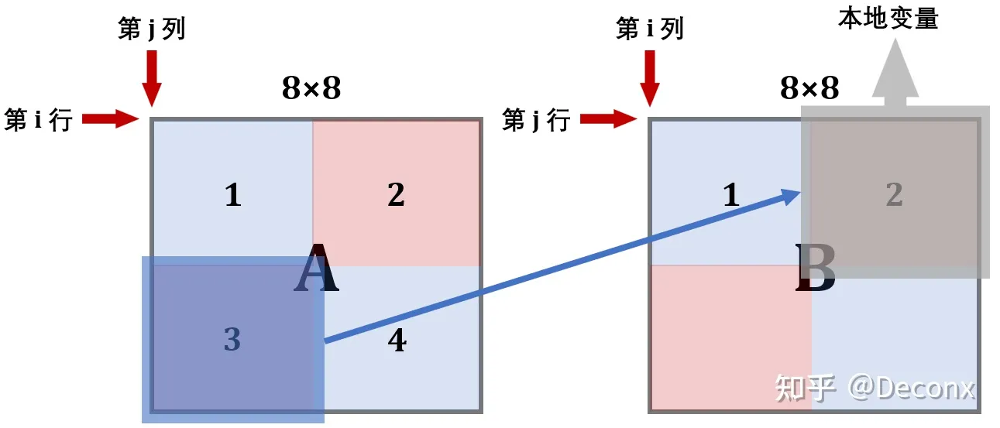

# Cache Lab

### Preparation

#### 了解 valgrind 工具箱

valgrind 是一个提供了一些 debug 和优化的工具的工具箱，可以使得你的程序减少内存泄漏或者错误访问。

有兴趣的可以先安装一下，不过在 Part A 貌似用不着：

```bash
sudo apt install valgrind
```

我们通过给定一个命令，就可以让 valgrind 进行内存使用的分析，例如我们如果想研究 `ls -l` 运行过程中的内存活动，我们可以输入：

```bash
valgrind --log-fd=1 --tool=lackey -v --trace-mem=yes ls -l
```

将内存使用的情况按照顺序打印在 `stdout` 标准输出中，如下图：


关于 valgrind 的相关文档可以参考：

其中，我们前往 valgrind 的官网：[User Manual](https://valgrind.org/docs/manual/manual.html)

注意到，valgrind 的内存分析格式例如：

```
I 0400d7d4,8
 M 0421c7f0,4
 L 04f6b868,8
 S 7ff0005c8,8
```

每一行表示的内存访问格式形如：

```
[space]operation address,size
```

- `operation` 一栏表示了内存访问的类型，例如 `I` 表示指令加载（Instruction Load），`L` 表示数据加载（Data Load），`S` 表示数据存储（Data Store），而 `M` 表示数据修改（Data Modify），相当于一次加载和一次缓存。在 `I` 指令前不会有空格，而在 `M`, `L` 和 `S` 指令前均有一个空格。
- `address` 一栏是一个表示 64 位的 16 进制地址，表示内存地址。
- `size` 则表示本次本次内存操作的字节数大小。

题目描述中，在目录 `traces` 下，就存在着若干这样的文件，例如 `yi.trace`：

```bash
L 10,1
M 20,1
L 22,1
S 18,1
L 110,1
L 210,1
M 12,1
```

### Puzzels

#### Part A

#### 实现目标

题目需要我们自己几乎从零开始编写 `csim.c` 文件，使得通过编译后 `csim` 实现的功能与文件夹内已经存在的可执行文件 `csim-ref` 功能一致。其中 `csim-ref` 所实现的功能就是根据 `trace` 文件的内容，和给定的高速缓存结构参数，分析出高速缓存的逐步操作。其参数对应描述如下：

```bash
Usage: ./csim-ref [-hv] -s <s> -E <E> -b <b> -t <tracefile>
• -h: Optional help flag that prints usage info
• -v: Optional verbose flag that displays trace info
• -s <s>: Number of set index bits (S = 2^s is the number of sets)
• -E <E>: Associativity (number of lines per set)
• -b <b>: Number of block bits (B = 2^b is the block size)
• -t <tracefile>: Name of the valgrind trace to replay
```

writeup 中明确指出了，我们本次实验只关心数据缓存的表现，因此对于 `I` 相关的指令，一律直接忽视（可以合理利用 `I` 开头指令没有空格来进行区分）此外，PDF 中还指出了，假设所有的内存是全部对齐的，我们尝试访问的数据也不会跨越 block 块。因此根据这点，我们可以直接忽略测试数据中的数据大小。

#### 代码实现

##### 数据结构

Part A 需要我们实现一个能执行数据读写的cache simulator，所以第一部首先想到的是创建一个Cache的结构体，由于我们此处不需要考虑b参数代表的偏移量，所以只需要考虑存储Cache中的set和line（笔者最开始考虑的是二维数组，但由于其容易越界的特性，最后决定使用了双重指针这种更模拟现实情况的方法）


于是我们根据 Cache 的组织结构，模拟出一个类似的组织结构：

```c
typedef struct {
    bool valid;
    unsigned long long tag;
    int timeStamp;
} cacheLine;

typedef struct {
    cacheLine* lines;
} cacheSet;

typedef struct {
    cacheSet* sets;
} cache;
```

可以看到，缓存由 `S` 个高速缓存组组成，每个高速缓存组内由 `E` 个缓存行构成。

缓存行内部由有效位 `valid`，标志位 `tag` 和 `B` 字节的高速缓存块组成。但是由于模拟的关系，我们暂时用不着缓存块，因此，不放入数据结构中。此外，由于要实现 LRU 算法，我们需要对各缓存行留下额外的空间保存最近更新的时间戳 `timeStamp`，以便到时确定应该驱逐哪一条缓存行。

##### 打印帮助提示

当输入 `-h` 指令时，或者当输入参数不正确的时候，我们需要打印使用提示，这个很好解决：

```c
void printUsage() {
    printf(
        "Usage: ./csim-ref [-hv] -s <num> -E <num> -b <num> -t <file>\n"
        "Options:\n"
        "  -h         Print this help message.\n"
        "  -v         Optional verbose flag.\n"
        "  -s <num>   Number of set index bits.\n"
        "  -E <num>   Number of lines per set.\n"
        "  -b <num>   Number of block offset bits.\n"
        "  -t <file>  Trace file.\n\n"
        "Examples:\n"
        "  linux>  ./csim-ref -s 4 -E 1 -b 4 -t traces/yi.trace\n"
        "  linux>  ./csim-ref -v -s 8 -E 2 -b 4 -t traces/yi.trace\n");
}
```

##### 获取输入参数

每次运行时，我们需要解析从终端传入的 `-s`, `-E`, `-b` 等相关参数，如有异常还需要进一步做出异常判断。在这里我们调用标准库中的 `getopt` 函数来解决问题。

```c
void getParam(int argc, char* argv[]) {
    // parse the command line
    int opt;
    while (-1 != (opt = getopt(argc, argv, "hvs:E:b:t:"))) {
        switch (opt) {
            case 'h':
                h = true;
                break;
            case 'v':
                v = true;
                break;
            case 's':
                s = atoi(optarg);
                break;
            case 'E':
                E = atoi(optarg);
                break;
            case 'b':
                b = atoi(optarg);
                break;
            case 't':
                // allocate memory for name of trace file first
                t = (char*)calloc(1000, sizeof(char)); 
                strcpy(t, optarg);
                break;
            default:
                printUsage();
                break;
        }
    }
    if (h) {
        printUsage();
        exit(0);
    }
    if (s <= 0 || E <= 0 || b <= 0 || t == NULL) {
        printf("%s: Missing required command line argument\n", argv[0]);
        printUsage();
        exit(-1);
    }
}
```

##### 初始化缓存结构

根据刚才传入的各个参数，开始初始化缓存结构，注意在参数化之前先在栈上分配好空间：

```c
cache* initCache(int s, int E) {
    // remember s is the exponential of sets
    int S = 1 << s;

    cache* Cache = (cache*)calloc(1, sizeof(cache));
    cacheSet* setArr = (cacheSet*)calloc(S, sizeof(cacheSet));
    Cache->sets = setArr;
    for (int i = 0; i < S; i++) {
        (setArr + i)->lines = (cacheLine*)calloc(E, sizeof(cacheLine));
    }
    return Cache;
}
```

##### 释放动态空间

当程序结束时，我们需要手动释放通过 `calloc` 申请的内存，内存包括缓存的数据结构 `c` 和文件名 `t` 字符串申请的空间：

```c
void releaseMem(cache* c, char* t) {
    int S = 1 << s;
    for (int i = 0; i < S; i++) {
        cacheSet* set = c->sets + i;
        free(set->lines);
    }
    free(c->sets);
    free(c);
    free(t);
}
```

##### 读取文件并处理

接下来我们需要打开对应路径对 trace 文件，对内部的内容进行读取和分析。

```c
void processFile(char* path, cache* Cache) {
    FILE* fp = fopen(path, "r");

    if (fp == NULL) {
        printf("%s: No such file or directory\n", path);
        exit(-1);
    }

    char op;
    unsigned long long addr;
    int size;
    char strLine[2024]; // temporary string

    while (fgets(strLine, sizeof(strLine), fp)) {
        if (strLine[0] == 'I') continue;
        if (sscanf(strLine, " %c %llX,%d", &op, &addr, &size) < 3) {
            printf("%s: Invalid Argument %s", path, strLine);
            exit(-1);
        }
        if (v) printf("%c %llX,%d ", op, addr, size);
        accessCache(op, addr, Cache);
    }
    fclose(fp);
}
```

##### 访问缓存

根据读取到的地址，通过位运算来得到映射到的高速缓存块的索引:

```c
void accessCache(char op, unsigned long long addr, cache* Cache) {
    // get the tag, set, and offset
    int matchTag = addr >> (b + s);
    int matchSetAddr = (addr >> b) & ((1 << s) - 1);
    cacheSet* set = Cache->sets + matchSetAddr;
    accessCacheSet(matchTag, op, set);
}
```

##### 访问缓存块

我们需要处理的操作共有三种，分别是 `L`, `M`, `S`，其中 `L` 和 `S` 分别代表数据加载和数据存储，需要访问地址一次，而 `M` 操作，可以看作两种操作的结合，需要访问地址两次。

```c
void accessCacheSet(unsigned long long matchTag, char op, cacheSet* set) {
    switch (op) {
        case 'L':
            lruUpdateSet(matchTag, set, 1);
            break;
        case 'M':
            // two times: load and store
            lruUpdateSet(matchTag, set, 2);
            break;
        case 'S':
            lruUpdateSet(matchTag, set, 1);
            break;
        default:
            printf("Invalid op %c\n", op);
            exit(-1);
    }
}
```

##### LRU 访问地址细节

各种操作可能的情形如下，由于 `M` 操作第二次是操作的同一个地址，因此必为 hit。而 `M`, `L` 和 `S` 第一次操作就有如下可能性：

- Hit，标志位和缓存组内部某一有效行对应，命中
-  Miss，标志位没有和任意一行有效行对应，未命中
  - 但是，缓存组内部存在空闲未使用的无效行，更新缓存时可直接将其填入
  -  Evict，或者，没有空闲的缓存行，必须挑选一条最久未使用的缓存行将其驱逐，将新的数据更新进去

综上：`L` 和 `S` 操作可能会发生：`hit`, `miss` 和 `miss eviction`。`M` 操作可能会发生 `hit hit`, `miss hit`, `miss eviction hit`。

```c
void lruUpdateSet(unsigned long long matchTag, cacheSet* set, int times) {
    /*
        we don't use 2-dimentional array to store the cache,
        just allocate the space for each line and use the address to access it
    */
    int isMiss = 0, isHit = 0, isEvict = 0;
    
    // 
    for (int k = 0; k < times; k++) {
        // check if hit and update the time stamp
        for (int i = 0; i < E; i++) {
            cacheLine* line = set->lines + i;
            if (line->valid && matchTag == line->tag) {
                isHit++;
                if (v) printf("%s ", "hit ");
                line->timeStamp = curTimeStamp++;
                break;
            }
        }
        if (isHit) continue;

        // if not hit, check if evict
        isMiss++;
        if (v) printf("%s", "miss ");

        // check if full
        bool isFilled = false;
        for (int i = 0; i < E; i++) {
            cacheLine* line = set->lines + i;
            if (!line->valid) {
                line->tag = matchTag;
                line->valid = true;
                line->timeStamp = curTimeStamp++;
                isFilled = true;
                break;
            }
        }
        if (isFilled) continue;

        isEvict++;
        if (v) printf("%s", "eviction ");

        // if not full, then evict the oldest
        cacheLine* oldestLine;
        int minStamp = 0x7fffffff;
        for (int i = 0; i < E; i++) {
            cacheLine* line = set->lines + i;
            if (minStamp > line->timeStamp) {
                minStamp = line->timeStamp;
                oldestLine = line;
            }
        }
        oldestLine->tag = matchTag;
        oldestLine->timeStamp = curTimeStamp++;
    }
    if (v) printf("\n");
    hit += isHit;
    miss += isMiss;
    eviction += isEvict;
}
```

##### main 函数实现

`main` 函数只需逐一执行上面的逻辑即可：

```c
int main(int argc, char* argv[]) {
    getParam(argc, argv);
    cache* c = initCache(s, E);
    processFile(t, c);
    releaseMem(c, t);
    printSummary(hit, miss, eviction);
    return 0;
}
```

### Part B

#### 实现目标

在此部分中，题目要求我们实现一个矩阵的转置方法，将一个 $N \times M \ or \  M \times M$ 的矩阵 `A`，转置后输出到 $M \times N \ or \  M \times M$ 的矩阵 `B` 空间中去。

writeup指定了缓存的大小和测试样例大小，要求我们使用参数 `-s 5 -E 1 -b 5`，也就是说缓存共有 `32` 个高速缓存组，每个缓存组中只有 `1` 个高速缓存行，每行中的缓存块大小为 `32` 字节。

给定的测试矩阵大小有三种，分别为（以下参数 `M` 在前，`N` 在后）：

- 32×3232 \times 3232×32 大小矩阵，要求尽可能将 miss 数量控制在 300 次以内
-  64×6464 \times 6464×64 大小矩阵，要求尽可能将 miss 数量控制在 1300 次以内
-  61×6761 \times 6761×67 大小矩阵，要求尽可能将 miss 数量控制在 2000 次以内

#### 注意事项

- 最多使用 `12` 个 `int` 类型的本地变量。
- 不能修改 `A` 矩阵的内容，`B` 矩阵可随意修改。
- 不能用 `malloc` 类函数申请内存。
- 矩阵 `A` 和矩阵 `B` 的内存分布是连续的。

#### 使用介绍

##### 填写代码

初看问题毫无头绪？直接先尝试一下`trans.c`里的样例函数，`ctrl c+v` 填进 `transpose_submit` 函数里，随后执行 `make; ./test-trans -M 32 -N 32`，可以看到程序针对 `trans.c` 中的两个方法分别进行了分析，在示例使用中，我们有提交函数 `transpose_submit`（作为 `func 0`）和 `trans` 函数（作为 `func 1`）。

首先检查了方法的正确性，其次程序统计了发生 miss 的次数，这里没有做任何优化的情况下高达 `1184` 次，由于两个函数完全一致，两个函数的分析结果也一致，非常的合理。但是最终结果以提交函数 `func 0` 为准。

##### debug 方法

纯看 miss 次数其实意义不大，更关键的是需要去寻找一个合理的办法进行 debug。

在刚才我们调用 `test-trans` 时，在目录下程序自动生成了两个 `trace` 文件，分别代表了刚才的 `func 0` 和 `func 1`，如果愿意，我们完全可以通过调用刚才完成的 `csim` 指令来查看具体是哪个位置发生了 miss：

#### 题目

##### 32 x 32 矩阵转置

s = 5, E = 1, b = 5 的缓存有32组，每组一行，每行存 8 个`int`，如图：


就以这个缓存为例，考虑暴力转置的做法：

```c
void trans_submit(int M, int N, int A[N][M], int B[M][N]) {
    for (int i = 0; i < N; i++) {
        for (int j = 0; j < M; j++) {
            int tmp = A[i][j];
            B[j][i] = tmp;
        }
    }
}
```

这里我们会按行优先读取 `A` 矩阵，然后一列一列地写入 `B` 矩阵。


以第1行为例，在从内存读 `A[0][0]` 的时候，除了 `A[0][0]` 被加载到缓存中，它之后的 `A[0][1]---A[0][7]` 也会被加载进缓存。

但是内容写入 `B` 矩阵的时候是一列一列地写入，在列上相邻的元素不在一个内存块上，这样每次写入都不命中缓存。并且一列写完之后再返回，原来的缓存可能被覆盖了，这样就又会不命中，我们来定量分析。

缓存只够存储一个矩阵的四分之一，`A`中的元素对应的缓存行每隔8行就会重复。`A`和`B`的地址由于取余关系，每个元素对应的地址是相同的，各个元素对应缓存行如下：


对于`A`，每8个`int`就会占满缓存的一组，所以每一行会有 32/8 = 4 次不命中；而对于`B`，考虑最坏情况，每一列都有 32 次不命中，由此，算出总不命中次数为 4 × 32 + 32 × 32 = 1152。拿程序跑一下：


结果为 1183 比预估多了一点，这是对角线部分两者冲突造成的，后面会讲到。

**回过头来，思考暴力做法：**


在写入`B`的前 8 行后，`B`的`D`区域就全部进入了缓存，此时如果能对`D`进行操作，那么就能利用上缓存的内容，不会`miss`；但是，暴力解法接下来操作的是`C`，每一个元素的写都要驱逐之前的缓存区，当来到第 2 列继续写`D`时，它对应的缓存行很可能已经被驱逐了，于是又要`miss`，也就是说，暴力解法的问题在于没有充分利用上已经进入缓存的元素。

分块解决的就是同一个矩阵内部缓存块相互替换的问题。

由上述分析，显然应考虑 8 × 8 分块，这样在块的内部不会冲突，接下来判断`A`与`B`之间会不会冲突


`A`中标红的块占用的是缓存的第 0，4，8，12，16，20，24，28组，而`B`中标红的块占用的是缓存的第2，6，10，14，18，16，30组，刚好不会冲突。事实上，**除了对角线**，`A`与`B`中对应的块都不会冲突。所以，我们的想法是可行的，写出代码：

```c
void transpose_submit(int M, int N, int A[N][M], int B[M][N])
{
    for (int i = 0; i < N; i += 8)
        for (int j = 0; j < M; j += 8)
            for (int k = 0; k < 8; k++)
                for (int s = 0; s < 8; s++)
                    B[j + s][i + k] = A[i + k][j + s];
}
```

对于`A`中每一个操作块，只有每一行的第一个元素会不命中，所以为8次不命中；对于`B`中每一个操作块，只有每一列的第一个元素会不命中，所以也为 8 次不命中。总共`miss`次数为：8 × 16 × 2 = 256

跑出结果：


`miss`次数为343，与我们计算的结果差距非常大，没有得到满分，这是为什么呢？这就要考虑到对角线上的块了。`A`与`B`对角线上的块在缓存中对应的位置是相同的，而它们在转置过程中位置不变，所以复制过程中会发生相互冲突。

以`A`的一个对角线块`p`，`B`与`p`相应的对角线块`q`为例，复制前， `p` 在缓存中。 复制时，`q`会驱逐`p`。 下一个开始复制 `p` 又被重新加载进入缓存驱逐 `q`，这样就会多产生两次`miss`。

为了解决这样的问题，我们需要引入临时变量（寄存器），通过暂时存储的方式，打乱原先的读写节奏，来达到减少冲突 miss 的效果。

关于分块，非常有借鉴意义的就是 CS:APP 在官网上贴出的学习资料了：

[CS:APP2e Web Aside MEM:BLOCKING: Using Blocking to Increase Temporal Locality](http://csapp.cs.cmu.edu/public/waside/waside-blocking.pdf)

也可以看这份中文版讲解：

[网络旁注：使用分块技术提高时间局部性](https://zhuanlan.zhihu.com/p/129392257)

##### 64 x 64 矩阵转置

每 4 行就会占满一个缓存，先考虑 4 × 4 分块，结果如下：


结果还不错，虽然没有得到满分。

还是考虑 8 × 8 分块，由于存在着每 4 行就会占满一个缓存的问题，在分块内部处理时就需要技巧了，我们把分块内部分成 4 个 4 × 4 的小分块分别处理：

- 第一步，将`A`的左上和右上一次性复制给`B`
- 第二步，用本地变量把`B`的右上角存储下来
- 第三步，将`A`的左下复制给`B`的右上
- 第四步，利用上述存储`B`的右上角的本地变量，把`A`的右上复制给`B`的左下
- 第五步，把`A`的右下复制给`B`的右下

画出图解如下：

**这里的`A`和`B`均表示两个矩阵中的 8 × 8 块**

**第 1 步：**


此时`B`的前 4 行就在缓存中了，接下来考虑利用这个缓存 。可以看到，为了利用`A`的缓存，第 2 块放置的位置实际上是错的，接下来就用本地变量保存`B`中 2 块的内容

**第 2 步：**

用本地变量把`B`的 2 块存储下来

```c
for (int k = j; k < j + 4; k++){
    a_0 = B[k][i + 4];
    a_1 = B[k][i + 5];
    a_2 = B[k][i + 6];
    a_3 = B[k][i + 7];
}
```

**第 3 步：**

现在缓存中还是存着`B`中上两块的内容，所以将`A`的 3 块内容复制给它



**第 4/5 步：**

现在缓存已经利用到极致了，可以开辟`B`的下面两块了


这样就实现了转置，且消除了同一行中的冲突

##### 61 x 67 矩阵转置

由于维数的不规则，导致内存空间映射到缓存上会非常的诡异。

我们就直接采用简单的分块策略进行分析即可，我们尝试不同的分块规模，形成下表：

|    分块规模    | miss 数量 |
| :------------: | :-------: |
|  $2 \times 2$  |   3116    |
|  $3 \times3$   |   2649    |
|  $4 \times 4$  |   2426    |
|   $5\times5$   |   2297    |
|   $6\times6$   |   2225    |
|   $7\times7$   |   2153    |
|   $8\times8$   |   2119    |
|   $9\times9$   |   2093    |
| $10 \times 10$ |   2077    |
| $11 \times 11$ |   2090    |
| $12 \times 12$ |   2058    |
|  $13\times13$  |   2049    |
|  $14\times14$  |   1997    |
|  $15\times15$  |   2022    |
| $16 \times 16$ |   1993    |
| $17 \times 17$ |   1951    |
|  $18\times18$  |   1962    |
| $19 \times 19$ |   1980    |
|  $20\times20$  |   2003    |
|  $21\times21$  |   1958    |
|  $22\times22$  |   1960    |
|  $23\times23$  |   1929    |
|  $24\times24$  |   2016    |

那么我们选择分块大小 $23\times23 $即可，miss 数量能够控制的比较合理

