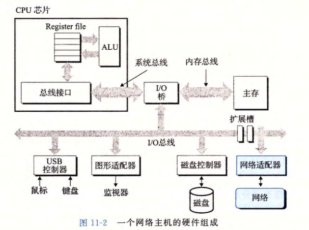
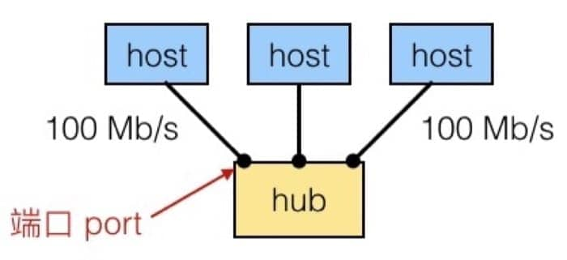
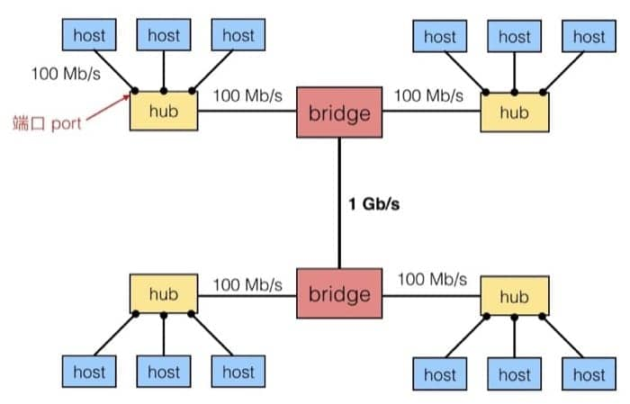
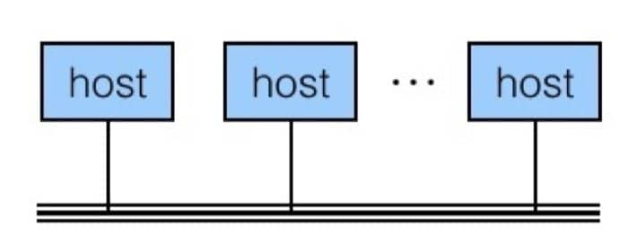
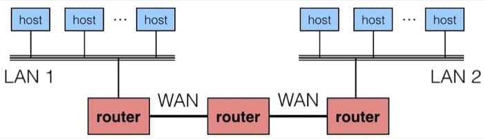
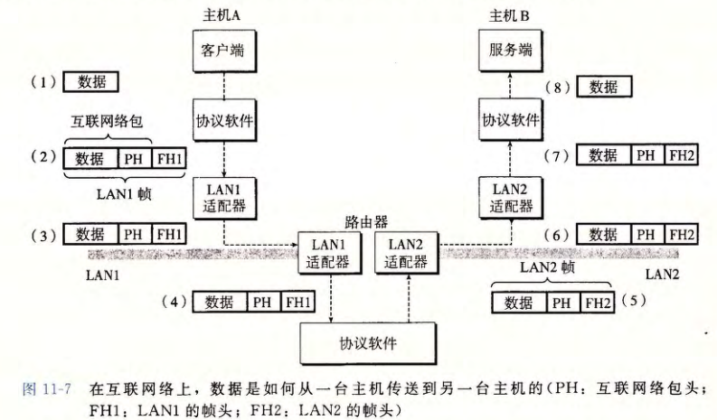
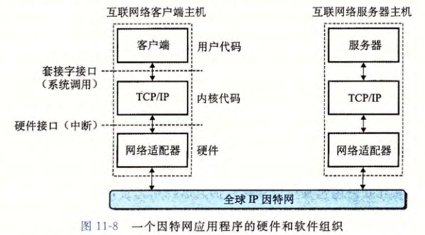
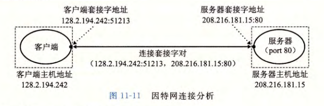
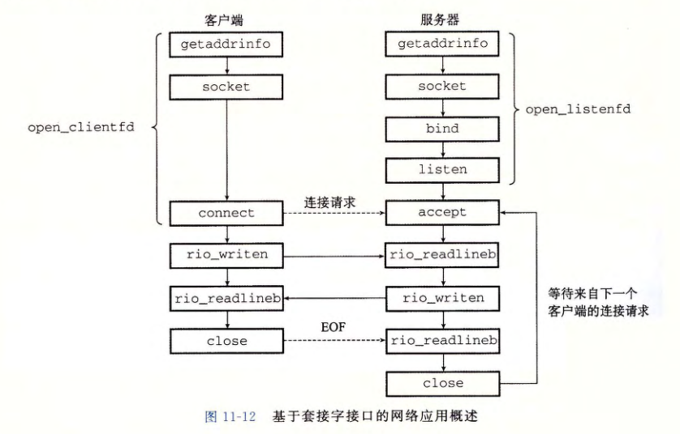

# Chapter 11 Network Programming

## 网络架构

网络应用都是基于**客户端-服务器模型**的。采用此模型，一个应用是由**一个服务器进程和一个或多个客户端进程**组成的。

服务器管理某种资源，并通过操作这种资源来为它的客户端提供服务。

客户端-服务器模型中的基本操作是**事务**。一个客户端-服务器事务包括以下四步：

1. 客户端需要服务时，向服务器发送一个请求，发起一个事务。比如客户端请求下载某个文件。
2. 服务器收到请求后，解释它并以适当方式操作自己的资源。比如服务器从磁盘读客户端所请求的文件。
3. 服务器给客户端发送一个响应，并等待下一个请求。比如将客户端请求的文件发送给客户端。
4. 客户端收到响应并处理它。比如客户端下载收到的文件。

注意客户端和服务器都是**进程**，两者可以在一台主机上也可以在不同的主机上。



根据网络的应用范围和架构层级，可以分成三个部分：

- SAN - System Area Network
  - Switched Ethernet, Quadrics QSW, …
- LAN - Local Area Network
  - Ethernet, ..
- WAN - Wide Area Network
  - High speed point-to-point phone lines

### 最底层 - Ethernet Segment

由若干主机(hosts)通过交换机(hub)连接，通常范围是房间或一层楼，如下图所示：



- 每个 Ethernet 适配器有一个唯一的 48 位的地址（也就是 MAC 地址），例如 `00:16:ea:e3:54:e6`
- 不同主机间发送的数据称为帧(frame)
- Hub 会把每个端口发来的所有数据复制到其他的端口
  - 所有的主机都可以看到所有的数据（注意安全问题）

### 下一层 - Bridged Ethernet Segment

通常范围是一层楼，通过不同的 bridge 来连接不同的 ethernet segment。Bridge 知道从某端口出发可达的主机，并有选择的在端口间复制数据。



为了从概念上简化，我们可以认为，所有的 hub, bridge 可以抽象为一条线，如下图所示：



### 下一层 - internet

不同的（也许不兼容）的 LAN 可以通过 router 来进行物理上的连接，这样连接起来的网络称为 internet（注意是小写，大写的 Internet 可以认为是最著名的 internet）



路由器也能连接高速点到点电话连接，这是称为 WAN (Wide-Area Network, 广域网）的网络示例，之所以这么叫是因为它们覆盖的地理范围比局域网的大。

## 网络协议

在不同的 LAN 和 WAN 中传输数据，就要守规矩，这个规矩就是协议。协议负责做的事情有：

- 提供 naming scheme
  - 定义 host address 格式
  - 每个主机和路由器都至少有一个独立的 internet 地址
- 提供 delivery mechanism
  - 定义了标准的传输单元 - packet
  - Packet 包含 header 和 payload
    - header 包括 packet size, source 和 destination address
    - payload 包括需要传输的数据

在这样的协议下，具体的数据传输如下图所示，这里 PH = Internet packet header, FH = LAN frame header



1. 主机 A 上的**客户端**进行一个**系统调用**，从客户端的虚拟地址空间复制数据到内核缓冲区中。
2. 主机 A 上的**协议软件**通过在数据前**附加互联网络包头和 LAN1 帧头**，创建了一个 LAN1 的帧，然后传送此帧到适配器。其中 LAN1 帧头寻址到路由器（理解：这应该是指链路层分组的首部），互联网络包头寻址到主机 B（理解：这应该指网络层 IP 数据报的首部）。
3. LAN1 适配器把该帧复制到网络上。
4. 此帧到达路由器时，**路由器的 LAN1 适配器**从电缆上读取它，并把它传送到**协议软件**。
5. 路由器从互联网络包头中**提取出目的互联网络地址，并用它作为路由表的索引，确定向哪里转发这个包**（本例中为 LAN2），路由器剥落掉旧的 LAN1 帧头，加上寻址到主机 B 的 LAN2 帧头，并把得到的帧传送到适配器。
6. 路由器的 LAN2 适配器复制该帧到网络上。
7. 此帧到达主机 B 时，它的**适配器**从电缆上读到此帧，并将它传送到**协议软件**。
8. 主机 B 上的**协议软件**剥落掉包头和帧头。当**服务器**进行一个读取这些数据的**系统调用**时，协议软件最终将得到的数据复制到服务器的虚拟地址空间



Internet 是 internet 最为著名的例子。主要基于 TCP/IP 协议族：

- IP (Internet Protocal)
  - Provides **basic naming scheme** and unreliable **delivery capability** of packets (datagrams) from **host-to-host**
- UDP (Unreliable Datagram Protocol)
  - Uses IP to provide **unreliable** datagram delivery from **process-to-process**
- TCP (Transmission Control Protocol)
  - Uses IP to provide **reliable** byte streams from **process-to-process** over **connections**

Accessed via a mix of Unix file I/O and functions from **sockets interface**.

- 主机有 32 位的 IP 地址 - 23.235.46.133
  - IPv4 - 32 位地址，IPv6 - 128 位地址
- IP 地址被映射到域名 - 23.235.46.133 映射到 www.wdxtub.com
- 不同主机之间的进程，可以通过 connection 来交换数据

### IP 地址

一个 IP 地址就是一个 **32 位无符号整数**，是以 network byte order（也就是大端序）来进行存储的，网络程序将 IP 地址存放在下面的 **IP 地址结构**中：

```c
// Internet address structure
struct in_addr {
    uint32_t s_addr;    // network byte order (big-endian)
}
```

为了方便读，一般用下面的形式来进行表示：

IP 地址：`0x8002C2F2 = 128.2.194.242`（前者是点分十进制）

由于现在的 intel 系统主要都是小端序，故而Unix 提供了几个函数来在网络和主机字节顺序间实现转换，如`                htonl        `、`htons`等函数，具体的转换还可以使用 `getaddrinfo` 和 `getnameinfo` 函数

### Internet 域名

域名到 IP 地址之间的映射通过分布在世界各地的数据库来维护。

DNS(Domain Naming System)数据库包含上百万条主机条目结构，每一条定义了一组域名和一组 IP 地址之间的映射。

每台主机都有**本地定义的域名 localhost**，这个域名总是映射为**回送地址 127.0.0.1**。具体可以用 `nslookup` 命令来查看，下面是一些例子

```bash
$ hostname
wdxtub.local

$ nslookup www.wdxtub.com
Server:		8.8.8.8
Address:	8.8.8.8#53

Non-authoritative answer:
www.wdxtub.com	canonical name = wdxtub.github.io.
wdxtub.github.io	canonical name = github.map.fastly.net.
Name:	github.map.fastly.net
Address: 23.235.39.133

$ nslookup www.twitter.com
Server:		8.8.8.8
Address:	8.8.8.8#53

Non-authoritative answer:
www.twitter.com	canonical name = twitter.com.
Name:	twitter.com
Address: 199.16.156.6
Name:	twitter.com
Address: 199.16.156.198
Name:	twitter.com
Address: 199.16.156.230
Name:	twitter.com
Address: 199.16.156.70
```

### Internet 连接

客户端和服务器通过连接(connection)来发送字节流，特点是：

- 点对点: 连接一对进程
- 全双工: 数据同时可以在两个方向流动
- 可靠: 字节的发送的顺序和收到的一致

连接的端点是**套接字**，套接字地址由一个 IP 地址和一个 16 位的端口号组成。用 “地址：端口” 来表示。客户端套接字地址中的端口是由内核自动分配的**临时端口**，服务器套接字地址中的端口通常是某个**熟知端口**。

Web 服务器常用端口 **80**，熟知名字为 http；邮件服务器使用端口 80，熟知名字为 smtp，文件 **/etc/services** 中包含一张主机提供的熟知端口与熟知名字之间的映射，一个连接由两端的套接字地址唯一确定。



### Socket 接口

一系列系统级的函数，和 Unix I/O 配合构造网络应用（在所有的现代操作系统上都可用）。

对于 kernel 来说，socket 是 endpoint of communication；对于应用程序来说，socket 是 file descriptor，用来读写，客户端和服务器通过读写对应的 socket descriptor 来进行。

具体连接的过程如下：



**1. 套接字地址结构**

套接字地址存放在 **sockaddr_in** 结构中。

```c
/* 互联网套接字地址结构 */
struct sockaddr_in {
    uint16_t        sin_family;  // 协议族
    uint16_t        sin_port;    // 网络字节顺序的端口号
    struct in_addr  sin_addr;    // 网络字节顺序的 IP 地址
    unsigned char   sin_zero[8];
}
/* 通用套接字地址结构 */
struct sockaddr {
    uint16_t  sa_family;    // 协议族
    char      sa_data[14];  // 地址
}
```

connect, bind, accept 函数都接受一个指向通用 sockaddr 结构的指针，然后要求应用程序将于协议特定结构相关的指针强制转换成这个通用结构。

**2. socket函数**

客户端和服务器都使用 socket 函数来创建一个套接字描述符。

```       c
#include<sys/types.h>
#include<sys/socket.h>
int socket(int domain, int type, int protocol);  // 如果成功返回描述符，出错返回 -1
```

**socket 函数的使用**

可以通过如下方式使套接字成为连接的一个端点。但最好使用 **getaddrinfo 函数**来自动生成这些参数，这样可以让代码与协议无关。

```            c
clientfd = socket(AF_INET, SOCK_STREAM, 0);  // AF_INET 表示使用 32 位 IP 地址， SOCK_STREAM 表示这个套接字是连接的一个端点。
```

socket 返回的 clientfd 描述符仅是部分打开的，还不能用于读写。如何完成打开套接字的工作，取决于是客户端还是服务器。

**3. connect函数**

客户端通过调用 connect 函数来建立和服务器的连接。

```              c
#include <sys/socket.h>
int connect(int clientfd, const struct sockaddr* addr, socklen_t addrlen); // 若成功返回 0，若出错返回 -1。
```

connect 函数会阻塞，一直到连接成功建立或发生错误。

**4. bind函数**

bind, listen 和 accept 函数都是服务器端用的函数。

bind 函数用来将套接字描述符和套接字地址关联起来。

```              c
#include <sys/socket.h>
int bind(int sockfd, const struct sockaddr* addr, socklen_t addrlen); // 若成功返回 0，若出错返回 -1。
```

**5. listen函数**

listen 函数将套接字转换为监听状态。

```   c
#include <sys/socket.h>
int listen(int sockfd, int backlog) // 若成功返回 0，若出错返回 -1。
```

参数 backlog 通常会设置为一个较大的值，如 1024。

**6. accept函数**

accept 函数用来接受来自客户端的连接请求。

```             c
#include <sys/socket.h>
int accept(int listenfd, struct sockaddr* addr, int* addrlen); // 若成功返回已连接描述符，若出错返回 -1。
```

## 简单服务器实现

### 架构总览

写服务器，最重要的就是理清思路，上节课我们介绍了诸多概念，尤其是最后提到的 `getaddrinfo` 和 `getnameinfo`，都是我们在搭建过程中必不可少的工具。参考上面的流程图，整个的工作流程有 5 步：

1. 开启服务器（`open_listenfd`函数，做好接收请求的准备）
   - `getaddrinfo`: 设置服务器的相关信息
   - `socket`: 创建 socket descriptor，也就是之后用来读写的 file descriptor
     - `int socket(int domain, int type, int protocol)`
     - 例如 `int clientfd = socket(AF_INET, SOCK_STREAM, 0);`
     - `AF_INET` 表示在使用 32 位 IPv4 地址
     - `SOCK_STREAM` 表示这个 socket 将是 connection 的 endpoint
     - 前面这种写法是协议相关的，建议使用 `getaddrinfo` 生成的参数来进行配置，这样就是协议无关的了
   - `bind`: 请求 kernel 把 socket address 和 socket descriptor 绑定
     - `int bind(int sockfd, SA *addr, socklen_t addrlen);`
     - The process can read bytes that arrive on the connection whose endpoint is `addr` by reading from descriptor `sockfd`
     - Similarly, writes to `sockfd` are transferred along connection whose endpoint is `addr`
     - 最好是用 `getaddrinfo` 生成的参数作为 `addr` 和 `addrlen`
   - `listen`: 默认来说，我们从`socket`函数中得到的 descriptor 默认是 active socket（也就是客户端的连接），调用`listen`函数告诉 kernel 这个 socket 是被服务器使用的
     - `int listen(int sockfd, int backlog);`
     - 把 `sockfd` 从 active socket 转换成 listening socket，用来接收客户端的请求
     - `backlog` 的数值表示 kernel 在接收多少个请求之后（队列缓存起来）开始拒绝请求
   - [*]`accept`: 调用`accept`函数，开始等待客户端请求
     - `int accept(int listenfd, SA *addr, int *addrlen);`
     - 等待绑定到 `listenfd` 的连接接收到请求，然后把客户端的 socket address 写入到 `addr`，大小写入到 `addrlen`
     - 返回一个 connected descriptor 用来进行信息传输（类似 Unix I/O）
     - 具体的过程可以参考 图3
2. 开启客户端（`open_clientfd`函数，设定访问地址，尝试连接）
   - `getaddrinfo`: 设置客户端的相关信息，具体可以参见 图1&2
   - `socket`: 创建 socket descriptor，也就是之后用来读写的 file descriptor
   - `connect`: 客户端调用`connect`来建立和服务器的连接
     - `int connect(int clientfd, SA *addr, socklen_t addrlen);`
     - 尝试与在 socker address `addr` 的服务器建立连接
     - 如果成功 `clientfd` 可以进行读写
     - connection 由 socket 对描述 `(x:y, addr.sin_addr:addr.sin_port)`
     - `x` 是客户端地址，`y` 是客户端临时端口，后面的两个是服务器的地址和端口
     - 最好是用 `getaddrinfo` 生成的参数作为 `addr` 和 `addrlen`
3. 交换数据（主要是一个流程循环，客户端向服务器写入，就是发送请求；服务器向客户端写入，就是发送响应）
   - [Client]`rio_writen`: 写入数据，相当于向服务器发送请求
   - [Client]`rio_readlineb`: 读取数据，相当于从服务器接收响应
   - [Server]`rio_readlineb`: 读取数据，相当于从客户端接收请求
   - [Server]`rio_writen`: 写入数据，相当于向客户端发送响应
4. 关闭客户端（主要是`close`）
   - [Client]`close`: 关闭连接
5. 断开客户端（服务接收到客户端发来的 EOF 消息之后，断开已有的和客户端的连接）
   - [Server]`rio_readlineb`: 收到客户端发来的关闭连接请求
   - [Server]`close`: 关闭与客户端的连接

### Client `open_clientfd`

用来建立和服务器的连接，协议无关

```c
int open_clientfd(char *hostname, char *port) {
    int clientfd;
    struct addrinfo hints, *listp, *p;
    
    // Get a list of potential server address
    memset(&hints, 0, sizeof(struct addrinfo));
    hints.ai_socktype = SOCK_STREAM; // Open a connection
    hints.ai_flags = AI_NUMERICSERV; // using numeric port arguments
    hints.ai_flags |= AI_ADDRCONFIG; // Recommended for connections
    getaddrinfo(hostname, port, &hints, &listp);
    
    // Walk the list for one that we can successfully connect to
    // 如果全部都失败，才最终返回失败（可能有多个地址）
    for (p = listp; p; p = p->ai_next) {
        // Create a socket descriptor
        // 这里使用从 getaddrinfo 中得到的参数，实现协议无关
        if ((clientfd = socket(p->ai_family, p->ai_socktype,
                               p->ai_protocol)) < 0)
            continue; // Socket failed, try the next
        
        // Connect to the server
        // 这里使用从 getaddrinfo 中得到的参数，实现协议无关
        if (connect(clientfd, p->ai_addr, p->ai_addrlen) != -1)
            break; // Success
        
        close(clientfd); // Connect failed, try another
    }
    
    // Clean up
    freeaddrinfo(listp);
    if (!p) // All connections failed
        return -1;
    else // The last connect succeeded
        return clientfd;
}
```

### Server `open_listenfd`

创建 listening descriptor，用来接收来自客户端的请求，协议无关

```c
int open_listenfd(char *port){
    struct addrinfo hints, *listp, *p;
    int listenfd, optval=1;
    
    // Get a list of potential server addresses
    memset(&hints, 0, sizeof(struct addrinfo));
    hints.ai_socktype = SOCK_STREAM; // Accept connection
    hints.ai_flags = AI_PASSIVE | AI_ADDRCONFIG; // on any IP address
    hints.ai_flags |= AI_NUMERICSERV; // using port number
    // 因为服务器不需要连接，所以原来填写地址的地方直接是 NULL
    getaddrinfo(NULL, port, &hints, &listp); 
    
    // Walk the list for one that we can successfully connect to
    // 如果全部都失败，才最终返回失败（可能有多个地址）
    for (p = listp; p; p = p->ai_next) {
        // Create a socket descriptor
        // 这里使用从 getaddrinfo 中得到的参数，实现协议无关
        if ((listenfd = socket(p->ai_family, p->ai_socktype,
                               p->ai_protocol)) < 0)
            continue; // Socket failed, try the next
        
        // Eliminates "Address already in use" error from bind
        setsockopt(listenfd, SOL_SOCKET, SO_REUSEADDR), 
                    (const void *)&optval, sizeof(int));
        
        // Bind the descriptor to the address
        if (bind(listenfd, p->ai_addr, p->ai_addrlen) == 0)
            break; // Success
        
        close(listenfd); // Bind failed, try another
    }
    
    // Clean up
    freeaddrinfo(listp);
    if (!p) // No address worked
        return -1;
    
    // Make it a listening socket ready to accept connection requests
    if (listen(listenfd, LISTENQ) < 0) {
        close(listenfd);
        return -1;
    }
    return listenfd;
}
```