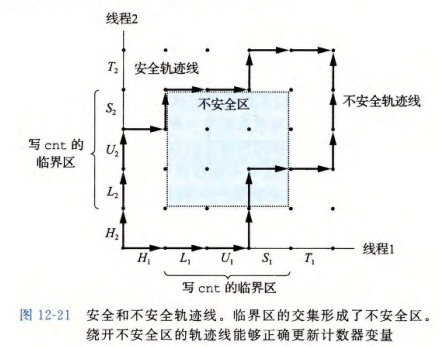

# Chapter 12 Concurrent Programming

## 并行方法

并行编程常见的错误有仨：竞争、死锁和活锁，尤其是在现在的多核处理器架构中，更容易出现这类并行问题。

前面实现过的服务器，一次只能处理一个请求，只有当前的请求处理完了，才能继续处理下一个。


这里具体讲解一下：Client 1 向 Server 发送连接请求(connect)，Server 接受(accept)之后开始等待 Client 1 发送请求（也就是开始 read），这之后 Client 1 发送具体的内容(write)后转为等待响应(call read)，Server 的 read 接收到了内容之后，发送响应(write) 后仅需进入等待(read)，而 Client 1 接收到了响应(ret read)，最后根据用户指令退出(close)。

而只有当 Client 1 断开之后，Server 才会处理 Client 2 的请求，从图中也可以看到这一点。具体是在哪里等待呢？因为 TCP 会缓存，所以实际上 Client 2 在 `ret read` 之前进行等待，为了解决这个问题，我们可以使用并行的策略，同时处理不同客户端发来的请求。

总体来说，根据系统机制的层级和实现方式，有下面三大类方法：

1. 基于进程
   - 内核自动管理多个逻辑流
   - 每个进程有其私有的地址空间（也就是说进程切换的时候需要保存和载入数据）
2. 基于事件
   - 由程序员手动控制多个逻辑流
   - 所有的逻辑流共享同一个地址空间
   - 这个技术称为 I/O multiplexing
3. 基于线程
   - 内核自动管理多个逻辑流
   - 每个线程共享地址空间
   - 属于基于进程和基于事件的混合体

### 基于进程

为每个客户端分离出一个单独的进程，是建立了连接之后才开始并行，连接的建立还是串行的。


具体的代码为

```c
void sigchld_handler(int sig){
    while (waitpid(-1, 0, WNOHANG) > 0)
        ;
    return;
    // Reap all zombie children
}

int main(int argc, char **argv) {
    int listenfd, connfd;
    socklen_t clientlen;
    struct sockaddr_storage clientaddr;
    
    Signal(SIGCHLD, sigchld_handler);
    listenfd = Open_listenfd(argv[1]);
    while (1) {
        clientlen = sizeof(struct sockaddr_storage);
        connfd = Accept(listenfd, (SA *) &clientaddr, &clientlen);
        if (Fork() == 0) {
            Close(listenfd); // Child closes its listening socket
            echo(connfd); // Child services client
            Close(connfd); // Child closes connection with client
            exit(0); // Child exits
        }
        Close(connfd); // Parent closes connected socket (important!)
    }
}
```

这里用文字描述一下流程：首先，服务器在 `accept` 函数中（对应 `listenfd`）等待连接请求，然后客户端通过调用 `connect` 函数发送连接请求，最后服务器在 `accept` 中返回 `connfd` 并且 fork 一个子进程来处理客户端连接，连接建立在 `listenfd` 和 `connfd` 间。

整个执行模型中：

- 每个客户端由独立子进程处理
  - 必须回收僵尸进程，来避免严重的内存泄露
- 不同进程之间不共享数据
- 父进程和子进程都有`listenfd`和`connfd`，所以在父进程中需要关闭`connfd`，在子进程中需要关闭`listenfd`
- 内核会保存每个 socket 的引用计数，在 fork 之后 `refcnt(connfd) = 2`，所以在父进程需要关闭 connfd，这样在子进程结束后引用计数才会为零

基于进程的方式可以并行处理连接，除了共享已打开的 file table 外，无论是 descriptor 还是全局变量都不共享，不大容易造成同步问题，比较简单粗暴。但是带来了额外的进程管理开销，并且进程间通讯不便，需要使用 IPC (interprocess communication)。

### 基于复用

基本的思路就是使用 select 函数，要求内核挂起进程，只有在一个或多个I/O 事件发生后，才将控制返回给应用程序。

I/O 多路复用可以用做并发**事件驱动**（event-driven）程序的基础，在事件驱动程序中，某些事件会导致流向前推进。一般的思路是将逻辑流模型化为状态机。不严格地说，一个**状态机**（state machine）就是一组**状态**（state）、**输入事件**（input event）和**转移**（transition），其中转移是将状态和输入事件映射到状态。每个转移是将一个（输入状态，输入事件）对映射到一个输出状态。**自循环**（self-loop）是同一输入和输岀状态之间的转移。通常把状态机画成有向图，其中节点表示状态，有向弧表示转移，而弧上的标号表示输入事件。一个状态机从某种初始状态开始执行。每个输入事件都会引发一个从当前状态到下一状态的转移。


```c
#include "csapp.h"

typedef struct { /* Represents a pool of connected descriptors */
    int maxfd;        /* Largest descriptor in read_set */
    fd_set read_set;  /* Set of all active descriptors */
    fd_set ready_set; /* Subset of descriptors ready for reading */
    int nready;       /* Number of ready descriptors from select */
    int maxi;         /* High water index into client array */
    int clientfd[FD_SETSIZE];    /* Set of active descriptors */
    rio_t clientrio[FD_SETSIZE]; /* Set of active read buffers */
} pool;

int byte_cnt = 0; /* Counts total bytes received by server */

int main(int argc, char **argv)
{
    int listenfd, connfd;
    socklen_t clientlen;
    struct sockaddr_storage clientaddr;
    static pool pool;

    if (argc != 2) {
        fprintf(stderr, "usage: %s <port>\n", argv[0]);
        exit(0);
    }
    listenfd = Open_listenfd(argv[1]);
    init_pool(listenfd, &pool);

    while (1) {
        /* Wait for listening/connected descriptor(s) to become ready */
        pool.ready_set = pool.read_set;
        pool.nready = Select(pool.maxfd + 1, &pool.ready_set, NULL, NULL, NULL);
        
        /* If listening descriptor ready, add new client to pool */
        if (FD_ISSET(listenfd, &pool.ready_set)) {
            clientlen = sizeof(struct sockaddr_storage);
            connfd = Accept(listenfd, (SA *)&clientaddr, &clientlen);
            add_client(connfd, &pool);
        }
        
        /* Echo a text line from each ready connected descriptor */
        check_clients(&pool);
    }
}
```

```c
void init_pool(int listenfd, pool *p)
{
    /* Initially, there are no connected descriptors */
    int i;
    p->maxi = -1;
    for (i = 0; i < FD_SETSIZE; i++)
        p->clientfd[i] = -1;
    
    /* Initially, listenfd is only member of select read set */
    p->maxfd = listenfd;
    FD_ZERO(&p->read_set);
    FD_SET(listenfd, &p->read_set);
}
```

```c
void add_client(int connfd, pool *p)
{
    int i;
    p->nready--;
    for (i = 0; i < FD_SETSIZE; i++) /* Find an available slot */
        if (p->clientfd[i] < 0) {
            /* Add connected descriptor to the pool */
            p->clientfd[i] = connfd;
            Rio_readinitb(&p->clientrio[i], connfd);

            /* Add the descriptor to descriptor set */
            FD_SET(connfd, &p->read_set);

            /* Update max descriptor and pool high water mark */
            if (connfd > p->maxfd)
                p->maxfd = connfd;
            if (i > p->maxi)
                p->maxi = i;
            break;
        }
    if (i == FD_SETSIZE) /* Couldn’t find an empty slot */
        app_error("add_client error: Too many clients");
}
```

```c
void check_clients(pool *p)
{
    int i, connfd, n;
    char buf[MAXLINE];
    rio_t rio;

    for (i = 0; (i <= p->maxi) && (p->nready > 0); i++) {
        connfd = p->clientfd[i];
        rio = p->clientrio[i];

        /* If the descriptor is ready, echo a text line from it */
        if ((connfd > 0) && (FD_ISSET(connfd, &p->ready_set))) {
            p->nready--;
            if ((n = Rio_readlineb(&rio, buf, MAXLINE)) != 0) {
                byte_cnt += n;
                printf("Server received %d (%d total) bytes on fd %d\n",
                       n, byte_cnt, connfd);
                Rio_writen(connfd, buf, n);
            }

            /* EOF detected, remove descriptor from pool */
            else {
                Close(connfd);
                FD_CLR(connfd, &p->read_set);
                p->clientfd[i] = -1;
            }
        }
    }
}
```

这段代码是一个简单的并发服务器，通过描述符池和`select`函数实现了多路复用，使服务器能够同时处理多个客户端连接。以下是代码的逻辑顺序：

1. **数据结构定义：**
   - 定义了一个结构体 `pool`，用于表示连接描述符的池，包含了一些状态信息和数组用于存储活跃的连接描述符和对应的读缓冲。

2. **全局变量定义：**
   - 定义了一个全局变量 `byte_cnt` 用于记录服务器接收到的总字节数。

3. **初始化描述符池：**
   - `init_pool` 函数初始化描述符池，将最大索引 `maxi` 设置为-1，所有客户端描述符初始化为-1，将监听套接字设置为描述符池中的唯一成员，并将其添加到描述符集合中。

4. **创建监听套接字和主循环：**
   - 在 `main` 函数中，通过 `Open_listenfd` 创建监听套接字，然后调用 `init_pool` 初始化描述符池。
   - 进入一个无限循环，在每次循环中通过 `Select` 函数等待监听和已连接描述符变为就绪状态。
   - 如果监听套接字变为就绪状态，表示有新的客户端连接请求，通过 `Accept` 接受连接，并调用 `add_client` 将新连接加入描述符池。
   - 调用 `check_clients` 处理就绪的已连接描述符，可能进行数据读取、写入等操作。

5. **新连接的添加（`add_client`函数）：**
   - 在 `add_client` 函数中，将新连接的描述符添加到描述符池中，找到一个空槽存储连接描述符，并初始化对应的读缓冲。
   - 将新连接的描述符添加到描述符集合中，并更新描述符池中的最大描述符和高水位标志。

6. **检查就绪描述符并处理（`check_clients`函数）：**
   - 在 `check_clients` 函数中，遍历描述符池中的每个已连接描述符，检查是否准备好。
   - 如果描述符就绪，通过 `Rio_readlineb` 从描述符中读取一行文本，计算字节数并打印。然后通过 `Rio_writen` 将数据回写到客户端。
   - 如果在读取时遇到 EOF，表示客户端关闭连接，从描述符池中移除，并关闭对应的描述符。

总体而言，这段代码实现了一个基本的并发服务器，通过描述符池和 `select` 实现了非阻塞的事件处理，能够同时处理多个客户端的连接请求和数据交互。

简单来说就是，服务器会维护一个 connection 数组，包含若干 `connfd`，每个输入请求都被当做事件，然后每次从已有的事件中选取一个进行处理。

基于实践的好处在于只使用一个逻辑控制流和地址空间，可以利用调试器进行单步调试（其他的方法因为并行的缘故基本没办法调试），也不会有进程/线程控制的开销。但是相比之下，代码的逻辑复杂度会比较高，很难进行精细度比较高的并行，也无法发挥多核处理器的全部性能。

### 基于线程

和基于进程的方法非常相似，唯一的区别是这里用线程。进程其实是比较『重』的，一个进程包括进程上下文、代码、数据和栈。如果从线程的角度来描述，一个进程则包括线程、代码、数据和上下文。也就是说，线程作为单独可执行的部分，被抽离出来了，一个进程可以有多个线程。

每个线程有自己的线程 id，有自己的逻辑控制流，也有自己的用来保存局部变量的栈（其他线程可以修改）但是会共享所有的代码、数据以及内核上下文。

和进程不同的是，线程没有一个明确的树状结构（使用 `fork` 是有明确父进程子进程区分的）。和进程中『并行』的概念一样，如果两个线程的控制流在时间上有『重叠』（或者说有交叉），那么就是并行的。


进程和线程的差别已经被说了太多次，这里简单提一下。相同点在于，它们都有自己的逻辑控制流，可以并行，都需要进行上下文切换。不同点在于，线程共享代码和数据（进程通常不会），线程开销比较小（创建和回收）

**POSIX Threads**

Pthreads 是一个线程库，基本上只要是 C 程序能跑的平台，都会支持这个标准。Pthreads定义了一套C语言的类型、函数与常量，它以 `pthread.h` 头文件和一个线程库实现。

Pthreads API 中大致共有 100 个函数调用，全都以 `pthread_` 开头，并可以分为四类：

1. 线程管理，例如创建线程，等待(join)线程，查询线程状态等。
2. Mutex：创建、摧毁、锁定、解锁、设置属性等操作
3. 条件变量（Condition Variable）：创建、摧毁、等待、通知、设置与查询属性等操作
4. 使用了读写锁的线程间的同步管理

POSIX 的 Semaphore API 可以和 Pthreads 协同工作，但这并不是 Pthreads 的标准。因而这部分API是以 `sem_` 打头，而非 `pthread_`。

我们用线程的方式重写一次之前的 Echo Server

```c
// Thread routine
void *thread(void *vargp){
    int connf = *((int *)vargp);
    // detach 之后不用显式 join，会在执行完毕后自动回收
    Pthread_detach(pthread_self());
    Free(vargp);
    echo(connfd);
    // 一定要记得关闭！
    Close(connfd);
    return NULL;
}

int main(int argc, char **argv) {
    int listenfd, *connfdp;
    socklen_t clientlen;
    struct sockaddr_storage clientaddr;
    pthread_t tid;
    
    listenfd = Open_listenfd(argv[1]);
    while (1) {
        clientlen = sizeof(struct sockaddr_storage);
        // 这里使用新分配的 connected descriptor 来避免竞争条件
        connfdp = Malloc(sizeof(int));
        *connfdp = Accept(listenfd, (SA *) & clientaddr, &clientlen);
        Pthread_create(&tid, NULL, thread, connfdp);
    }
}
```

在这个模型中，每个客户端由单独的线程进行处理，这些线程除了线程 id 之外，共享所有的进程状态（但是每个线程有自己的局部变量栈）。

使用线程并行，能够在不同的线程见方便地共享数据，效率也比进程高，但是共享变量可能会造成比较难发现的程序问题，很难调试和测试。

### 优劣比较

这里简单归纳下三种并行方法的特点：

- 基于进程
  - 难以共享资源，但同时也避免了可能带来的共享问题
  - 添加/移除进程开销较大
- 基于事件
  - 非常底层的实现机制
  - 使用全局控制而非调度
  - 开销比较小
  - 但是无法提供精细度较高的并行
  - 无法充分利用多核处理器
- 基于线程
  - 容易共享资源，但也容易出现问题
  - 开销比进程小
  - 对于具体的调度可控性较低
  - 难以调试（因为事件发生的顺序不一致）

## 同步

### 共享变量

在介绍同步之前，我们需要弄清楚一个定义，什么是 Shared variable（共享变量）？

> A variable `x` is *shared* if and only if multiple threads reference some instance of `x`

另外一个需要注意的是线程的内存模型，因为概念上的模型和实际的模型有一些差异，非常容易导致错误。

在概念上的模型中：

- 多个线程在一个单独进程的上下文中运行
- 每个线程有单独的线程上下文（线程 ID，栈，栈指针，PC，条件码，GP 寄存器）
- 所有的线程共享剩下的进程上下文
  - Code, data, heap, and shared library segments of the process virtual address space
  - Open files and installed handlers

在实际的模型中，寄存器的值虽然是隔离且被保护的，但是在栈中的值并不是这样的（其他线程也可以访问）。

我们来看一个简单的例子：

```c
char **ptr; // 全局变量

int main()
{
    long i;
    pthread_t tid;
    char *msgs[2] = {
        "Good Day!",
        "Bad Day!"
    };
}

ptr = msgs;
for (i = 0; i < 2; i++)
    Pthread_create(&tid, NULL, thread, (void *)i);
Pthread_exit(NULL);
}

void *thread(void *vargp)
{
    long myid = (long)vargp;
    static int cnt = 0;
    
    // 这里每个线程都可以访问 ptr 这个全局变量
    printf("[%ld]: %s (cnt=%d)\n", myid, ptr[myid], ++cnt);
    return NULL;
}
```

这里有几个不同类型的变量，我们一一来看一下：

- 全局变量：在函数外声明的变量
  - 虚拟内存中有全局唯一的一份实例
- 局部变量：在函数内声明，且没有用 static 关键字
  - 每个线程的栈中都保存着对应线程的局部变量
- 局部静态变量：在函数内用 static 关键字声明的变量
  - 虚拟内存中有全局唯一的一份实例

具体来分析下，一个变量只有在被多个线程引用的时候才算是共享，在这个例子中，共享变量有 `ptr`, `cnt` 和 `msgs`；非共享变量有 `i` 和 `myid`。

### 关键区域 Critical Section

这一部分我们用一个具体的例子来进行讲解，看看如何用多个线程来计数：

```c
// 全局共享变量
volatile long cnt = 0; // 计数器

int main(int argc, char **argv)
{
    long niters;
    pthread_t tid1, tid2;
    
    niter2 = atoi(argv[1]);
    Pthread_create(&tid1, NULL, thread, &niters);
    Pthread_create(&tid2, NULL, thread, &niters);
    Pthread_join(tid1, NULL);
    Pthread_join(tid2, NULL);
    
    // 检查结果
    if (cnt != (2 * niters))
        printf("Wrong! cnt=%ld\n", cnt);
    else
        printf("Correct! cnt=%ld\n", cnt);
    exit(0);
}
```

运行之后发现不是每次都出现同样的结果，我们把操作 `cnt` 的部分抽出来单独看一看：

线程中循环部分的代码为：

```c
for (i = 0; i < niters; i++)
    cnt++;
```

对应的汇编代码为

```assembly
    # 以下四句为 Head 部分，记为 H
    movq    (%rdi), %rcx
    testq   %rcx, %rcx
    jle     .L2
    movl    $0, %eax
.L3:
    movq    cnt(%rip), %rdx # 载入 cnt，记为 L
    addq    $1, %rdx        # 更新 cnt，记为 U
    movq    %rdx, cnt(%rip) # 保存 cnt，记为 S
    # 以下为 Tail 部分，记为 T
    addq    $1, %rax
    cmpq    %rcx, %rax
    jne     .L3
.L2:
```

这里有一点需要注意，`cnt` 使用了 `volatile` 关键字声明，意思是不要在寄存器中保存值，无论是读取还是写入，都要对内存操作（还记得 write-through 吗？）。这里把具体的步骤分成 5 步：HLUST，尤其要注意 LUS 这三个操作，这三个操作必须在一次执行中完成，一旦次序打乱，就会出现问题，不同线程拿到的值就不一定是最新的。



更多相关内容，可以参考[Synchronization - Basics](http://wdxtub.com/vault/csapp-23.html)，其中提到了利用图表来描述关键区域的方法，感兴趣可以看一下。

### 信号量

针对关键区域的问题，我们可以考虑用信号量来限制程序的执行顺序。计数信号量具备两种操作动作，称为 V（又称signal()）与 P（wait()）。 V 操作会增加信号量 S 的数值，P 操作会减少。运作方式：

1. 初始化，给与它一个非负数的整数值。
2. 运行 P，信号量 S 的值将被减少。企图进入临界区块的进程，需要先运行 P。当信号量 S 减为负值时，进程会被挡住，不能继续；当信号量S不为负值时，进程可以获准进入临界区块。
3. 运行 V，信号量 S 的值会被增加。结束离开临界区块的进程，将会运行 V。当信号量 S 不为负值时，先前被挡住的其他进程，将可获准进入临界区块。

我们来看看如何修改可以使得前面我们的计数程序正确运行。

```c
// 先定义信号量
volatile long cnt = 0;
sem_t mutex;

Sem_init(&mutex, 0, 1);


// 在线程中用 P 和 V 包围关键操作
for (i = 0; i < niters; i++)
{
    P(&mutex);
    cnt++;
    V(&mutex);
}
```


在使用线程时，脑中需要有一个清晰的分享变量的概念，共享变量需要互斥访问，而 Semaphores 是一个基础的机制。

## 生产者-消费者问题


具体的同步模型为：

- 生产者等待空的 slot，把 item 存储到 buffer，并通知消费者
- 消费整等待 item，从 buffer 中移除 item，并通知生产者

主要用于

- 多媒体处理
  - 生产者生成 MPEG 视频帧，消费者进行渲染
- 事件驱动的图形用户界面
  - 生产者检测到鼠标点击、移动和键盘输入，并把对应的事件插入到 buffer 中
  - 消费者从 buffer 中获取事件，并绘制到到屏幕上

接下来我们实现一个有 n 个元素 buffer，为此，我们需要一个 mutex 和两个用来计数的 semaphore：

- `mutex`: 用来保证对 buffer 的互斥访问
- `slots`: 统计 buffer 中可用的 slot 数目
- `items`: 统计 buffer 中可用的 item 数目

我们直接来看代码，就比较清晰了

```c
// 头文件 sbuf.h
// 包括几个基本操作
#include "csapp.h"

typedef struct {
    int *buf;    // Buffer array
    int n;       // Maximum number of slots
    int front;   // buf[(front+1)%n] is first item
    int rear;    // buf[rear%n] is the last item
    sem_t mutex; // Protects accesses to buf
    sem_t slots; // Counts available slots
    sem_t items; // Counts available items
} sbuf_t;

void sbuf_init(sbuf_t *sp, int n);
void sbuf_deinit(sbuf_t *sp);
void sbuf_insert(sbuf_t *sp, int item);
int sbuf_remove(sbuf_t *sp);
```

然后是具体的实现

```c
// sbuf.c

// Create an empty, bounded, shared FIFO buffer with n slots
void sbuf_init(sbuf_t *sp, int n) {
    sp->buf = Calloc(n, sizeof(int));
    sp->n = n;                  // Buffer holds max of n items
    sp->front = sp->rear = 0;   // Empty buffer iff front == rear
    Sem_init(&sp->mutex, 0, 1); // Binary semaphore for locking
    Sem_init(&sp->slots, 0, n); // Initially, buf has n empty slots
    Sem_init(&sp->items, 0, 0); // Initially, buf has 0 items
}

// Clean up buffer sp
void sbuf_deinit(sbuf_t *sp){
    Free(sp->buf);
}

// Insert item onto the rear of shared buffer sp
void sbuf_insert(sbuf_t *sp, int item) {
    P(&sp->slots);                        // Wait for available slot
    P(&sp->mutext);                       // Lock the buffer
    sp->buf[(++sp->rear)%(sp->n)] = item; // Insert the item
    V(&sp->mutex);                        // Unlock the buffer
    V(&sp->items);                        // Announce available item
}

// Remove and return the first tiem from the buffer sp
int sbuf_remove(sbuf_f *sp) {
    int item;
    P(&sp->items);                         // Wait for available item
    P(&sp->mutex);                         // Lock the buffer
    item = sp->buf[(++sp->front)%(sp->n)]; // Remove the item
    V(&sp->mutex);                         // Unlock the buffer
    V(&sp->slots);                         // Announce available slot
    return item;
}
```

## 读者-写者问题

是互斥问题的通用描述，具体为：

- 读者线程只读取对象
- 写者线程修改对象
- 写者对于对象的访问是互斥的
- 多个读者可以同时读取对象

常见的应用场景是：

- 在线订票系统
- 多线程缓存 web 代理

根据不同的读写策略，又两类读者写者问题，需要注意的是，这两种情况都可能出现 starvation。

> 第一类读者写者问题（读者优先）

- 如果写者没有获取到使用对象的权限，不应该让读者等待
- 在等待的写者之后到来的读者应该在写者之前处理
- 也就是说，只有没有读者的情况下，写者才能工作

> 第二类读者写者问题（写者优先）

- 一旦写者可以处理的时候，就不应该进行等待
- 在等待的写者之后到来的读者应该在写者之后处理

具体的代码为

```c
sbuf_t sbuf; // Shared buffer of connected descriptors


static int byte_cnt;  // Byte counter
static sem_t mutex;   // and the mutex that protects it


void echo_cnt(int connfd){
    int n;
    char buf[MAXLINE];
    rio_t rio;
    static pthread_once_t once = PTHREAD_ONCE_INIT;
    
    Pthread_once(&once, init_echo_cnt);
    Rio_readinitb(&rio, connfd);
    while ((n = Rio_readlineb(&rio, buf, MAXLINE)) != 0) {
        P(&mutex);
        byte_cnt += n;
        printf("thread %d received %d (%d total) bytes on fd %d\n",
                    (int) pthread_self(), n, byte_cnt, connfd);
        V(&mutex);
        Rio_writen(connfd, buf, n);
    }
}

static void init_echo_cnt(void){
    Sem_init(&mutex, 0, 1);
    byte_cnt = 0;
}

void *thread(void *vargp){
    Pthread_detach(pthread_self());
    while (1) {
        int connfd = sbuf_remove(&sbuf); // Remove connfd from buf
        echo_cnt(connfd);                // Service client
        Close(connfd);
    }
}

int main(int argc, char **argv) {
    int i, listenfd, connfd;
    socklen_t clientlen;
    struct sockaddr_storage clientaddr;
    pthread_t tid;
    
    listenfd = Open_listenfd(argv[1]);
    sbuf_init(&sbuf, SBUFSIZE);
    for (i = 0; i < NTHREADS; i++) // Create worker threads
        Pthread_create(&tid, NULL, thread, NULL);
    while (1) {
        clientlen = sizeof(struct sockaddr_storage);
        connfd = Accept(listenfd, (SA *)&clientaddr, &clientlen);
        sbuf_insert(&sbuf, connfd); // Insert connfd in buffer
    }
}
```

## 线程安全

在线程中调用的函数必须是线程安全的，定义为：

> A function is thread-safe iff it will always produce correct results when called repeatedly from multiple concurrent threads

主要有 4 类线程不安全的函数

1. 不保护共享变量的函数
   - 解决办法：使用 P 和 V semaphore 操作
   - 问题：同步操作会影响性能
2. 在多次调用间保存状态的函数
   - 解决办法：把状态当做传入参数
3. 返回指向静态变量的指针的函数
   - 解决办法1：重写函数，传地址用以保存
   - 解决办法2：上锁，并且进行复制
4. 调用线程不安全函数的函数
   - 解决办法：只调用线程安全的函数

另一个重要的概念是 Reentrant Function，定义为：

> A function is **reentrant** iff it accesses no shared variables when called by multiple threads

Reentrant Functions 是线程安全函数非常重要的子集，不需要同步操作，对于第二类的函数来说（上面提到的），唯一的办法就是把他们修改成 reentrant 的。

标准 C 库中的函数都是线程安全的（如 `malloc`, `free`, `printf`, `scanf`），大多数 Unix 的系统调用也都是线程安全的。

总结来看，并行编程需要注意的是：

- 要有并行策略，可以把一个大任务分成若干个独立的子任务，或者用分而治之的方式来解决
- 内循环最好不要有任何同步机制
- 注意 Amdahl’s Law
- 一致性是个大问题，无论是计算一致性还是存储一致性，都需要仔细考虑

## 可重入性

有一类重要的线程安全函数，叫做**可重入函数**（reentrant function），其特点在于它们具有这样一种属性：当它们被多个线程调用时，不会引用任何共享数据。尽管**线程安全**和**可重入**有时会（不正确地）被用做同义词，但是它们之间还是有清晰的技术差别，值得留意。图 12-39 展示了可重入函数、线程安全函数和线程不安全函数之间的集合关系。所有函数的集合被划分成不相交的线程安全和线程不安全函数集合。可重入函数集合是线程安全函数的一个真子集。


可重入函数通常要比不可重入的线程安全的函数高效一些，因为它们不需要同步操作。更进一步来说，将第 2 类线程不安全函数转化为线程安全函数的唯一方法就是重写它，使之变为可重入的。例如，图 12-40 展示了图 12-37 中 rand 函数的一个可重入的版本。关键思想是我们用一个调用者传递进来的指针取代了静态的 next 变量。

## 竞争

当一个程序的正确性依赖于一个线程要在另一个线程到达 y 点之前到达它的控制流中的 x 点时，就会发生**竞争**（race）。通常发生竞争是因为程序员假定线程将按照某种特殊的轨迹线穿过执行状态空间，而忘记了另一条准则规定：多线程的程序必须对任何可行的轨迹线都正确工作。

例子是理解竞争本质的最简单的方法。让我们来看看图 12-42 中的简单程序。主线程创建了四个对等线程，并传递一个指向一个唯一的整数 ID 的指针到每个线程。每个对等线程复制它的参数中传递的 ID 到一个局部变量中（第 22 行），然后输出一个包含这个 ID 的信息。它看上去足够简单，但是当我们在系统上运行这个程序时，我们得到以下不正确的结果：

```c
/* WARNING: This code is buggy! */
#include "csapp.h"
#define N 4

void *thread(void *vargp);

int main()
{
    pthread_t tid[N];
    int i;

    for (i = 0; i < N; i++)
        Pthread_create(&tid[i], NULL, thread, &i);
    for (i = 0; i < N; i++)
        Pthread_join(tid[i], NULL);
    exit(0);
}

/* Thread routine */
void *thread(void *vargp)
{
    int myid = *((int *)vargp);
    printf("Hello from thread %d\n", myid);
    return NULL;
}
```

> 图 12-42 一个具有竞争的程序

问题是由每个对等线程和主线程之间的竞争引起的。你能发现这个竞争吗？下面是发生的情况。当主线程在第 13 行创建了一个对等线程，它传递了一个指向本地栈变量 i 的指针。在此时，竞争出现在下一次在第 12 行对 i 加 1 和第 22 行参数的间接引用和赋值之间。如果对等线程在主线程执行第 12 行对 i 加 1 之前就执行了第 22 行，那么 myid 变量就得到正确的 ID。否则，它包含的就会是其他线程的 ID。令人惊慌的是，我们是否得到正确的答案依赖于内核是如何调度线程的执行的。在我们的系统中它失败了，但是在其他系统中，它可能就能正确工作，让程序员 “幸福地”察觉不到程序的严重错误。

为了消除竞争，我们可以动态地为每个整数 ID 分配一个独立的块，并且传递给线程例程一个指向这个块的指针，如图 12-43 所示（第 12 ~ 14 行）。请注意线程例程必须释放这些块以避免内存泄漏。

```c
#include "csapp.h"
#define N 4

void *thread(void *vargp);

int main()
{
    pthread_t tid[N];
    int i, *ptr;

    for (i = 0; i < N; i++) {
        ptr = Malloc(sizeof(int));
        *ptr = i;
        Pthread_create(&tid[i], NULL, thread, ptr);
    }
    for (i = 0; i < N; i++)
        Pthread_join(tid[i], NULL);
    exit(0);
}

/* Thread routine */
void *thread(void *vargp)
{
    int myid = *((int *)vargp);
    Free(vargp);
    printf("Hello from thread %d\n", myid);
    return NULL;
}
```

> 图 12-43   图 12-42 中程序的一个没有竞争的正确版本

## 死锁

信号量引入了一种潜在的令人厌恶的运行时错误，叫做**死锁**（deadlock），它指的是一组线程被阻塞了，等待一个永远也不会为真的条件。进度图对于理解死锁是一个无价的工具。例如，图 12-44 展示了一对用两个信号量来实现互斥的线程的进程图。


图 12-44 一个会死锁的程序的进度图

从这幅图中，我们能够得到一些关于死锁的重要知识：

- 程序员使用 P 和 V 操作顺序不当，以至于两个信号量的禁止区域重叠。如果某个执行轨迹线碰巧到达了**死锁状态 d**，那么就不可能有进一步的进展了，因为重叠的禁止区域阻塞了每个合法方向上的进展。换句话说，程序死锁是因为每个线程都在等待其他线程执行一个根不可能发生的 V 操作。
- 重叠的禁止区域引起了一组称为**死锁区域**（deadlock region）的状态。如果一个轨迹线碰巧到达了一个死锁区域中的状态，那么死锁就是不可避免的了。轨迹线可以进入死锁区域，但是它们不可能离开。
- 死锁是一个相当困难的问题，因为它不总是可预测的。一些幸运的执行轨迹线将绕开死锁区域，而其他的将会陷入这个区域。图 12-44 展示了每种情况的一个示例。对于程序员来说，这其中隐含的着实令人惊慌。你可以运行一个程序 1000 次不出任何问题，但是下一次它就死锁了。或者程序在一台机器上可能运行得很好，但是在另外的机器上就会死锁。最糟糕的是，错误常常是不可重复的，因为不同的执行有不同的轨迹线。

程序死锁有很多原因，要避免死锁一般而言是很困难的。然而，当使用二元信号量来实现互斥时，如图 12-44 所示，你可以应用下面的简单而有效的规则来避免死锁：

**互斥锁加锁顺序规则：给定所有互斥操作的一个全序，如果每个线程都是以一种顺序获得互斥锁并以相反的顺序释放，那么这个程序就是无死锁的。**