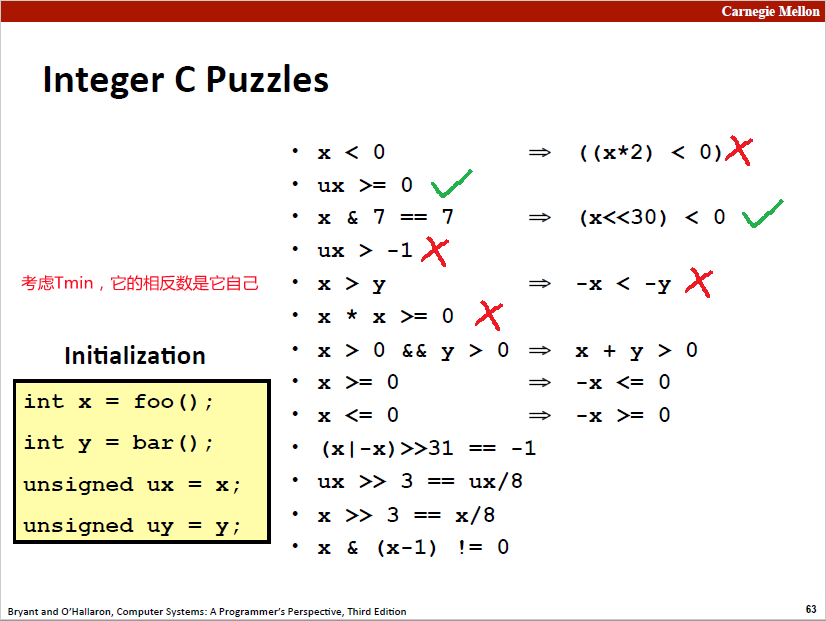
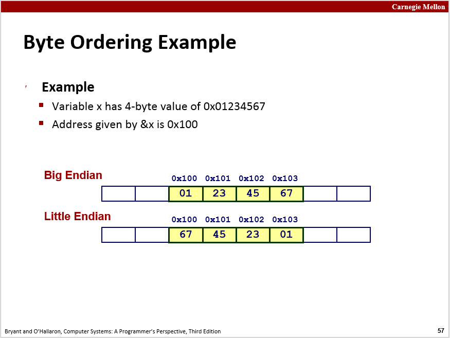
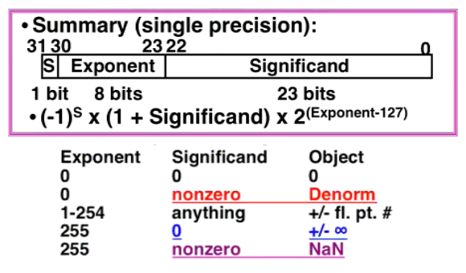
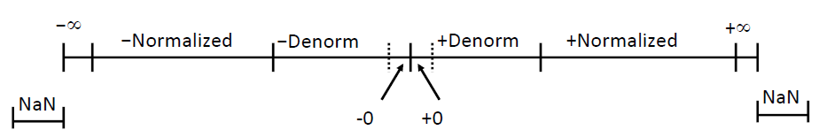

# Chapter 2 Representing and Manipulating Information

#### 2.1 Bits, Bytes and Intergers



- $INT\_MIN = 1000 \ (0000)_6 \ 0000, \ INT\_MAX = 0111 \ (1111)_6 \ 1111$.

- ##### 如何通过补码推导出原码:

  - -1
    补码：[ 11111111 ]

    ⇓ （逐位取反）

    反码：[ 00000000 ]

     ⇓ （+1）

    原码：[ 00000001 ]

- int类型与unsighed int类型比较大小：按照unsighed直接逐位比较.
- 进行运算时考虑溢出，即：INT_MAX + 1 = INT_MIN.
- int类型的num乘2即将原码向左移动一位，乘$2^2$即向左移动两位.



​		带符号数产生意外结果的例子。这个例子会造成无限循环，因为sizeof会返回unsigned int 类型，由此带来的结果是，i - sizeof(char)这个表达式的求值结果将会是 unsigned int (隐式转换 !!)，无符号数 0 减 1 会变成 0xFFFFFFFF，从而产生无限循环.

```c++
// Demo_4
int n = 10, i; 
for (i = n - 1 ; i - sizeof(char) >= 0; i--)
    printf("i: 0x%x\n",i);

if (-1 > 0U)                     // 神奇的算术!! 
    printf("You Surprised me!\n"); 
```

**例3 (拓展):**  高德纳在《计算机程序设计的艺术》指出，虽然早在1946年就有人将二分查找的方法公诸于世，但直到1962年才有人写出没有bug的二分查找程序，可见，写一个安全的代码并不容易，你是不是一不小心就写出像下面这样的二分查找代码了？

```
int binary_search(int a[], int len, int key){
	int low = 0; 
	int high = len - 1; 
	while ( low <= high ) {
		int mid = (low + high)/2;   // 提示：这里有溢出Bug！
		if (a[mid] == key) {
			return mid;
		}
		if (key < a[mid]) {
			high = mid - 1;
		} else{
			low = mid + 1;
		}
	}
	return -1;
}
```

#### 2.2 Floating Point



- 在对极大或极小的数字进行运算时，可能会出现数位问题:

```c++
// Demo_3
#include <assert.h>

int main(){
    assert(+0. == -0.);      // 断言成功
    assert(1.0/+0. == 1.0/-0.); // 断言失败
    return 0;
}
```



- 浮点数运算:

```c++
// 有问题的版本 
#include <stdio.h>
int main() {
    float sum = 0.0f;
    for (int i = 0; i < 10000; i++) sum += i + 1;
      printf("Sum: %f\n", sum);
    return 0;
}
// 程序的结果真的是1 + 2 + 3 + … + 10000 = 10000 * (10000 + 1) / 2 = 50005000 吗?
// 实则不然，Sum: 50002896.000000
```

- 
  原因是：在每次迭代中，sum += i + 1; 将整数 i + 1 加到浮点数 sum 上。由于浮点数的表示方式，它具有固定的有效位数。当累加的数值很大时，浮点数的有效位数就不足以保持所有的精度，因此会发生精度损失。

```c++
// 修正的版本
#include <stdio.h>
int main() {
    float sum = 0.0f, corr = 0.0f; /* corrective value for rounding error */
    for (int i = 0; i < 10000; i++) {
      float y = (i + 1) - corr; /* add the correction to specific item */
      float t = sum + y; /* bits might be lost */
      corr = (t - sum) - y; /* recover lost bits */
      sum = t;
    }
    printf("Sum: %f\n", sum);
    return 0;
}
```

#### Exercise

2.58: 写一个函数返回所使用机器的大小端类型，示例代码如下：

```c++
#include <stdio.h>

int is_little_endian(void){
    union w
    {
      int a;
      char b;
    }c;
    c.a = 1;
    return (c.b == 1); // 小端返回TRUE,大端返回FALSE
}

int main(int argc, char *argv[]) {
    if(is_little_endian())
        printf("Little Endian\n");
    return 0;
}
```

- `union` 是一种特殊的数据结构，用于在同一内存位置存储不同类型的数据，允许多个成员共享同一块内存，并且每次只能使用其中一个成员。