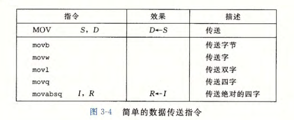
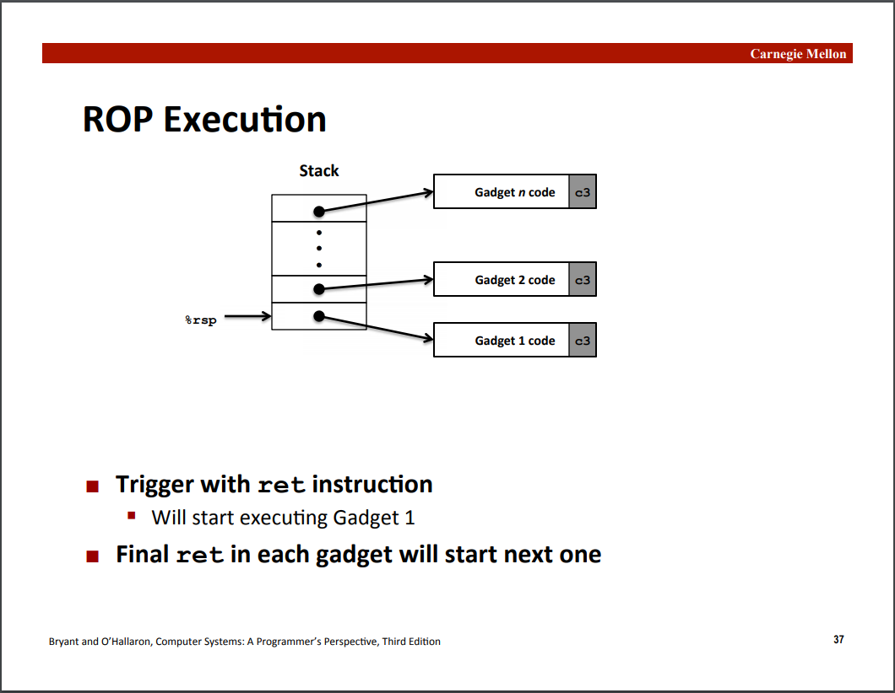

# Chapter 3 Machine-Level Representation of Programs

#### 3.1 A Historical Perspective

#### 3.2  Program Encodings


**Instructure Set Architecture**：指令集架构 (包括指令规格，寄存器等)，简称ISA，它是软硬件之间的“合同”

**Mircoarchitecture**：指令集架构的具体实现方式 (比如流水线级数，缓存大小等)，它是可变的

**Machine Code**：机器码，也就是机器可以直接执行的二进制指令

**Assembly Code**：汇编码，也就是机器码的文本形式 (主要是给人类阅读)


C程序的编译过程：源代码 `->` 编译 `->` 汇编 `->` 链接 `->` 可执行文件 `->` 装载 `->` 执行

#### 3.3   Data Formats


#### 3.4  Accessing Information

**整数寄存器**


前六个寄存器(%rax, %rbx, %rcx, %rdx, %rsi, %rdi)称为通用寄存器，有其『特定』的用途：

- %rax(%eax) 用于做累加
- %rcx(%ecx) 用于计数
- %rdx(%edx) 用于保存数据
- %rbx(%ebx) 用于做内存查找的基础地址
- %rsi(%esi) 用于保存源索引值
- %rdi(%edi) 用于保存目标索引值

而 %rsp(%esp) 和 %rbp(%ebp) 则是作为栈指针和基指针来使用的

**操作数格式**


寻址模式可以分别利用立即数 (immediate) 、寄存器 (register) 和内存引用三种如上图所示的方式

**数据传输指令**




**压入和弹出栈数据**


#### 3.5  Arithmetic and Logical Operations

**算术与逻辑运算**


#### 3.6  Control

**条件码**

四个标识位（CF, ZF, SF, OF）就是用来辅助程序的流程控制的，意思是：

- CF: Carry Flag (针对无符号数)
- ZF: Zero Flag
- SF: Sign Flag (针对有符号数)
- OF: Overflow Flag (针对有符号数)

可以看到以上这四个标识位，表示四种不同的状态，举个例子，假如我们有一条诸如 `t = a + b` 的语句，汇编之后假设用的是 `addq Src, Dest`，那么根据这个操作结果的不同，会相应设置上面提到的四个标识位，而因为这个是执行类似操作时顺带尽心设置的，称为隐式设置，例如：

- 如果两个数相加，在最高位还需要进位（也就是溢出了），那么 CF 标识位就会被设置
- 如果 t 等于 0，那么 ZF 标识位会被设置
- 如果 t 小于 0，那么 SF 标识位会被设置
- 如果 2’s complement 溢出，那么 OF 标识位会被设置为 1（溢出的情况是 `(a>0 && b > 0 && t <0) || (a<0 && b<0 && t>=0)`）

**比较与测试指令**


**SET指令**


一条 SET 指令的目的操作数是低位单字节寄存器元素（图 3-2) 之一，或是个字节的内存位置，指令会将这个字节设置成 或者。为了得到 32 位或 64 位结果，我们必须对高位清零

**跳转指令**


#### 3.7   Procedures

**通用的栈帧结构**


**转移控制指令**


到目前为止我们看到的大多数过程示例都不需要 超出寄存器大小的本地存储区域。不过有些时候，局部数据必须存放在内存中，常见的情况包括： 

- 寄存器不足够存放所有的本地数据。

- 对一个局部变蜇使用地址运算符＇＆＇，因此必须能够为它产生一个地址

- 某些局部变量是数组或结构，因此必须能够通过数组或结构引用被访问到

在描述数组和结构分配时，我们会讨论这个问题一般来说，过程通过减小栈指针在栈上分配分配的结果作为栈帧的一部分，标号为＂局部变量＇，

#### 3.8   Array Allocation and Access

#### 3.9   Heterogeneous Data Structures

**struct**

```c++
struct rec { 
    int i; 
    int j; 
    int a[2]; 
    int *p; 
}; 
```

这个结构包括4个字段：两个字节 int、一个由两个类型为 int 的元素组成的数组和一个8字节整型指针，总共是 24 个字节： 


**union**

```c++
union U3 {
	char c;
	int i [2];
	double v;
}; 
```

与同样的struct相比

```c++
struct S3 {
	char c;
	int i[2];
	double v;
}; 
```

在一台 x86-64 Linux 机器上编译时，字段的偏移量、数据类型 S3 U3 的完整大小如下：


**数据对齐**


#### 3.10   Combining Control and Data in Machine-Level Programs

**使用 GDB 调试器**


**内存越界引用和缓冲区溢出**

简单的示例程序（运行gets前的栈）：


简单的示例程序（运行gets后的栈：两种情况）：


**攻击代码示例**




**如何避免缓冲区溢出问题？**

1. 程序员层面，避免调用不安全的函数，比如，fgets代替gets，strncpy代替strcpy
2. 操作系统层面，增加保护机制，例如ASLR (地址空间随机化)，让攻击者难以猜测地址（依然可以攻破）

实际上，今天的绝大多数系统在默认情况下是启用ASLR的，可以通过以下命令查看**：**

```bash
$ cat /proc/sys/kernel/randomize_va_spac4
```

返回值：

- 0 没有随机化，也就是关闭 ASLR 
- 1 保留的随机化，其中共享库、栈、mmap 以及 VDSO 将被随机化
- 2 完全的随机化，在 1 的基础上，通过 brk() 分配的内存空间也将被随机化

**注意**：在用GDB调试时，可以通过set disable-randomization命令开启或者关闭地址空间随机化，默认是关闭随机化的，也就是on状态，具体参见：[GDB](https://sourceware.org/gdb/onlinedocs/gdb/Starting.html)

3. 硬件层面，对栈区增加权限保护： *NX （*No-eXecute*），*gcc编译选项 -z  *execstack*/noexecstack

4. 编译器层面，缓冲区溢出的检测（Stack Guard），又被称作栈“金丝雀”（Canary） 