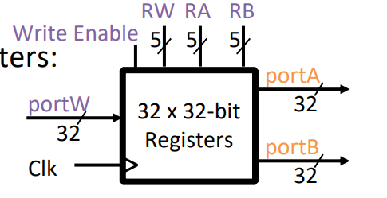
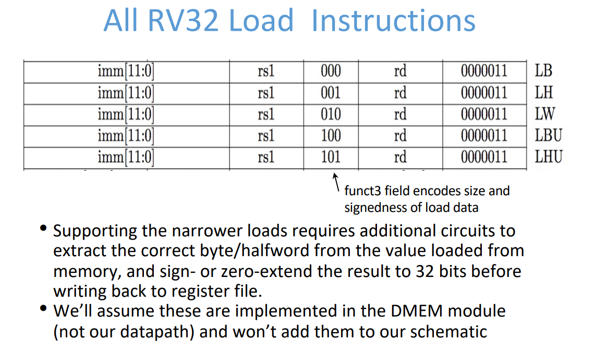

# Chapter 4 Processor Architecture

## **Risc-V指令**


### R-Type

R-type是一个指令集架构（Instruction Set Architecture，ISA）的代表。R-type指令是MIPS指令集中的一类指令，主要用于执行寄存器-寄存器操作。


#### Basic Operation

R-Type指令的格式包括以下字段：

1. **Opcode（操作码）：** 操作码字段指定了要执行的具体操作，例如加法、减法等。不同的操作有不同的操作码。

2. **Source Register (rs)：** 源寄存器字段指定了源操作数的寄存器。

3. **Target Register (rt/rs2)：** 目标寄存器字段指定了结果存储的寄存器。 (通常用于存储一个操作的第二个源操作数。在一些指令中，`rt`字段可能也被用作目标寄存器，但这主要取决于具体的指令。例如，在ADD指令中，`rt`字段就是第二个源操作数的寄存器，而在SUB指令中，`rt`字段则是目标寄存器。)

4. **Destination Register (rd)：** 目的寄存器字段指定了结果要存储的寄存器。

5. **Shift Amount：** 位移量字段表示在一些指令中对寄存器进行位移操作时的位移量。

6. **Function Code (funct)：** 功能码字段进一步细化了操作，对于R-type指令，这个字段用于区分具体的操作，例如加法、减法、逻辑运算等。

#### R-Type指令的格式

```
OPCODE   |  RS  |  RT  |  RD  |  SHIFT AMOUNT |  FUNCT
-----------------------------------------------------
  6位    |  5位 |  5位 |  5位 |      5位       |  6位
```

在MIPS指令集中，常见的R-type指令包括：

- **ADD：** 加法
- **SUB：** 减法
- **AND：** 逻辑与
- **OR：** 逻辑或
- **SLT：** 设置小于
- **SLL：** 逻辑左移
- **SRL：** 逻辑右移

这些指令的具体操作由Opcode和Funct字段决定。例如，ADD指令的Opcode是000000，而Funct字段为100000，所以完整的ADD指令的二进制表示为：

```
000000 | rs | rt | rd | shamt | 100000
```

其中，rs、rt、rd等字段分别代表具体的寄存器编号。

请注意，R-type指令是MIPS指令集的一部分，其他架构可能有不同的指令集和执行方式。

#### R-Type的实现逻辑


#### R-Type的电路实现


其中Reg[] (Register File)硬件如下：



更多的操作数如下：


### I-Type

在MIPS指令集架构中，I-type指令是一类指令，主要用于执行立即数（immediate）和寄存器之间的操作。

#### Basic Operation

I-type指令的格式包括以下字段：

1. **Opcode（操作码）：** 操作码字段指定了要执行的具体操作，例如加载、存储、分支等。不同的操作有不同的操作码。

2. **Source Register (rs)：** 源寄存器字段指定了源操作数的寄存器。

3. **Target Register (rt)：** 目标寄存器字段指定了结果存储的寄存器。

4. **Immediate：** 立即数字段包含一个常数值，用于与寄存器的值执行某种操作，例如加法、加载等。

#### I-Type指令的格式

```
OPCODE   |  RS  |  RT  |        IMMEDIATE
----------------------------------------
  6位    |  5位 |  5位 |         16位
```

常见的I-Type指令包括：

1. **Load（加载）指令：**
   - **LW (Load Word):** 从内存中加载一个字到寄存器中。
   - **LB (Load Byte):** 从内存中加载一个字节到寄存器中。

2. **Store（存储）指令：**
   - **SW (Store Word):** 将寄存器中的字存储到内存中。
   - **SB (Store Byte):** 将寄存器中的字节存储到内存中。

3. **Branch（分支）指令：**
   - **BEQ (Branch if Equal):** 如果两个寄存器相等，则分支到目标地址。
   - **BNE (Branch if Not Equal):** 如果两个寄存器不相等，则分支到目标地址。

4. **Immediate Arithmetic（立即数运算）指令：**
   - **ADDI (Add Immediate):** 将寄存器中的值与立即数相加。
   - **SUBI (Subtract Immediate):** 将寄存器中的值减去立即数。

这些指令允许进行加载/存储、分支和一些简单的算术运算，扩展了MIPS指令集的功能。I-type指令通常用于执行不涉及寄存器-寄存器之间的复杂操作的任务。

#### I-Type的实现逻辑


#### Arithmetic I-Type


其中ImmSel (Immediate Select)通常是“立即数选择”的缩写。这个选择通常用于决定指令中的立即数是作为一个有符号数还是无符号数来处理，或者它是一个相对于某个地址的偏移量。

具体来说，ImmSel可能涉及到以下方面：

1. **有符号和无符号：** ImmSel字段可以表示是要将立即数视为有符号数还是无符号数。例如，在加载（Load）或分支（Branch）指令中，ImmSel可以指定是有符号扩展还是零扩展。

2. **立即数的使用方式：** ImmSel字段还可以指示立即数的使用方式，例如，是作为算术运算的操作数还是作为跳转目标的偏移量。

##### 电路实现


#### Load I-Type

##### 电路实现


其中

1. WBSel (Write Back Select)是“写回选择”的一种缩写。在计算机体系结构中，特别是在流水线式的处理器中，写回选择通常是指选择哪个结果要写回到寄存器文件（Register File）中
2. DEME(Data Memory)硬件如下


更多的操作数如下：



### S-Type

在计算机指令集体系结构中，S-Type（Store Type）指令是一类用于存储（Store）数据到内存中的指令。这类指令的操作通常涉及将寄存器中的数据写入内存的某个地址。

#### Basic Operation

1. **Opcode（操作码）：** 操作码字段指定要执行的具体存储操作。

2. **Base Register (rs1)：** 源寄存器字段指定要存储的数据。

3. **Offset：** 偏移量字段表示相对于基址寄存器（Base Register）的偏移量，用于计算实际的存储地址。

4. **Destination Register (rs2)：** 目标寄存器字段指定基址寄存器的值与偏移量相加后的结果是否需要写回。在某些 S-Type 指令中，这个字段可能不存在，因为结果可能并不需要写回寄存器。

具体的 S-Type 指令的格式可能会根据不同的指令集架构有所不同。

####  S-Type 指令的格式

```
OPCODE |  RS1 |  RS2 | OFFSET
------------------------------
6 bits |  5 bits |  5 bits | 16 bits
```

常见的S-Type指令包括：

1. **SW (Store Word)：** 从寄存器存储一个字（32位）到内存中的指定地址。

2. **SH (Store Halfword)：** 从寄存器存储一个半字（16位）到内存中的指定地址。

3. **SB (Store Byte)：** 从寄存器存储一个字节到内存中的指定地址。

这些指令允许将寄存器中的数据存储到内存的不同位置，具体的存储方式取决于偏移量和基址寄存器的值。

#### S-Type的电路实现


其中RegWEn (Register Write Enable)的缩写，指的是寄存器写使能信号。在数字电路和计算机体系结构中，这个信号通常用于控制寄存器文件（Register File）中的寄存器是否接受写入操作。

具体来说，RegWEn 可能有以下两种状态：

1. **使能状态（Enable）：** 当 RegWEn 处于使能状态时，寄存器文件将接受写入操作。指令的结果将被写入指定的寄存器。

2. **禁用状态（Disable）：** 当 RegWEn 处于禁用状态时，寄存器文件不接受写入操作。指令的结果将不会写入寄存器，即寄存器中的内容保持不变。

RegWEn 信号通常由控制单元生成，根据指令的类型和执行阶段的需要来确定是否允许写入寄存器。在流水线处理器中，不同的阶段可能需要不同的 RegWEn 控制。

总的来说，RegWEn 是一个用于控制寄存器写使能的信号，用于确保寄存器文件在执行指令时正确地接受或禁止写入操作。

### SB-Type

"SB-Type" 是一种指令格式，通常用于在计算机指令集架构中表示分支（Branch）类的指令。具体来说，SB-Type 指令通常用于实现条件分支，根据某些条件是否满足来改变程序的执行流程。

#### Basic Operation

1. **Opcode（操作码）：** 操作码字段指定要执行的分支操作。

2. **Source Register 1 (rs1)：** 源寄存器字段，包含条件分支判断中的一个操作数。

3. **Source Register 2 (rs2)：** 另一个源寄存器字段，包含条件分支判断中的另一个操作数。

4. **Immediate：** 立即数字段，用于指定分支目标地址的偏移量。

具体的 SB-Type 指令可能涉及到不同的条件分支操作，例如等于、不等于、小于、大于等。这些条件将由具体的操作码和功能码决定。

#### SB-Type 指令的格式

SB-Type 指令的一般格式包括以下字段：

```
OPCODE |  RS1 |  RS2 | IMMEDIATE
--------------------------------
6 bits |  5 bits |  5 bits | 16 bits
```

以下是一些可能的 SB-Type 指令的条件分支操作：

1. **BEQ（Branch if Equal）：** 如果两个源寄存器的值相等，则进行分支。

   - 例如：

     ```
     BEQ rs1, rs2, offset
     ```

2. **BNE（Branch if Not Equal）：** 如果两个源寄存器的值不相等，则进行分支。

   - 例如：

     ```
     BNE rs1, rs2, offset
     ```

3. **BLT（Branch if Less Than）：** 如果第一个源寄存器的值小于第二个源寄存器的值，则进行分支。

   - 例如：

     ```
     BLT rs1, rs2, offset
     ```

4. **BGE（Branch if Greater Than or Equal）：** 如果第一个源寄存器的值大于等于第二个源寄存器的值，则进行分支。

   - 例如：

     ```
     BGE rs1, rs2, offset
     ```

5. **BLTU（Branch if Less Than Unsigned）：** 无符号整数比较，如果第一个源寄存器的无符号值小于第二个源寄存器的无符号值，则进行分支。

   - 例如：

     ```
     BLTU rs1, rs2, offset
     ```

6. **BGEU（Branch if Greater Than or Equal Unsigned）：** 无符号整数比较，如果第一个源寄存器的无符号值大于等于第二个源寄存器的无符号值，则进行分支。

   - 例如：

     ```
     BGEU rs1, rs2, offset
     ```

在这些指令中，`rs1` 和 `rs2` 是源寄存器，`offset` 是一个相对于当前指令地址的偏移量。条件分支操作根据指定的条件进行判断，如果条件满足，则分支到新的地址执行，否则继续执行下一条指令。这样的条件分支指令用于控制程序执行流程，实现条件性的跳转。

#### SB-Type的电路实现


其中Branch Comp. (Branch Comparator)硬件如下


### Jumping I-Type

在计算机指令集架构中，"Jumping I-Type" 指令通常用于实现无条件跳转（Jump）或跳转到子程序的操作。这类指令的具体操作和行为可能会有一些变化，具体取决于指令集架构的设计。

#### Basic Operation

一般而言，Jumping I-Type 指令的格式可能包括以下字段：

1. **Opcode（操作码）：** 操作码字段指定要执行的跳转操作。
2. **Target Address (Target)：** 目标地址字段指定要跳转到的地址。
3. **Link Register (Link)：** 这个字段通常表示跳转指令之前的地址，有时也叫做返回地址，用于实现子程序的调用和返回。

#### Jumping I-Type 指令的格式

以下是一个简化的 Jumping I-Type 指令格式示例：

```plaintext
OPCODE | TARGET ADDRESS | LINK REGISTER
--------------------------------------
6 bits |     26 bits    |    5 bits
```

具体的 Jumping I-Type 指令的操作可能包括：

1. **无条件跳转（Unconditional Jump）：** 直接跳转到指定的目标地址，不受任何条件的限制。

   ```assembly
   JUMP 0x80001000
   ```

2. **跳转到子程序（Jump to Subroutine）：** 将当前地址保存到链接寄存器中，然后跳转到指定的目标地址。用于实现函数或子程序的调用和返回。

   ```assembly
   JSR 0x80002000
   ```

3. **跳转并链接（Jump and Link）：** 将当前地址保存到链接寄存器中，然后跳转到指定的目标地址。这个链接寄存器通常用于保存返回地址，以实现函数或子程序的调用和返回。

   ```assembly
   JAL TargetAddress ; Jump and Link
   ```

   这个指令会将当前指令的下一个地址（即返回地址）保存到链接寄存器中，然后跳转到 `TargetAddress`。

4. **带条件跳转（Conditional Jump）：** 根据某些条件判断是否执行跳转。

   ```assembly
   BEQ rs1, rs2, TargetAddress ; Branch if Equal
   ```

   在这个示例中，如果寄存器 `rs1` 的值等于寄存器 `rs2` 的值，则跳转到 `TargetAddress`。

5. **跳转到寄存器地址（Jump to Register Address）：** 跳转到存储在寄存器中的目标地址。

   ```assembly
   JR rs ; Jump to Register
   ```

   这个指令会从寄存器 `rs` 中取出地址并跳转到该地址。

#### Jumping I-Type 的电路实现


### J-Type

在计算机指令集架构中，"J-Type" 指令通常用于实现跳转（Jump）操作。这类指令的主要目的是无条件地改变程序的执行流程，跳转到指定的目标地址。具体的 J-Type 指令格式和操作可能会有所不同，具体取决于指令集架构的设计。

#### Basic Operation

一般而言，J-Type 指令的格式可能包括以下字段：

1. **Opcode（操作码）：** 操作码字段指定要执行的跳转操作。

2. **Target Address (Target)：** 目标地址字段指定要跳转到的地址。

#### J-Type 指令的格式

以下是一个简化的 J-Type 指令格式示例：

```plaintext
OPCODE | TARGET ADDRESS
-----------------------
6 bits |     26 bits
```

J-Type 指令可能包括以下一些基本的跳转操作：

1. **无条件跳转（Unconditional Jump）：** 直接跳转到指定的目标地址，不受任何条件的限制。

   ```assembly
   J TargetAddress ; Jump
   ```

2. **跳转并链接（Jump and Link）：** 类似于 J-Type 指令，但可能包括将当前地址保存到链接寄存器中，以实现函数或子程序的调用和返回。

   ```assembly
   JAL TargetAddress ; Jump and Link
   ```

   这个指令会将当前指令的下一个地址（即返回地址）保存到链接寄存器中，然后跳转到 `TargetAddress`。

#### J-Type 的电路实现


## **处理器的设计步骤**

1. 分析指令，推导出数据通路需求
2. 为所需的数据通路选择合适的组件
3. 连接各个组件建立数据通路
4. 分析指令的实现，以确定控制信号
5. 集成控制信号，形成完整的控制逻辑

## **单周期处理器设计**：

- 数据通路 + 实现控制逻辑  (本质 = 组合逻辑电路 + 时序逻辑电路)

**引申**：控制与数据分离的设计思想也广泛应用在其他领域，比如网络通信领域中引入了SDN

备注：数字电路不是本课程的重点，如果不熟悉的朋友请参考 P&H Book. 附录. The Basics of Logic Design


From P&H Book：组合逻辑单元，时序逻辑单元

  示例：以下是简单的RISC-V单周期处理器的设计（MIPS也类似），来自P&H Book


From P&H Book：single-cycle datapath


## 流水线技术：

- 现代处理器借鉴了汽车生产的流水线技术，使得指令能够并行执行（ILP）

示例：以下是简单的RISC-V流水线处理器的设计（MIPS也类似），来自P&H Book


From P&H Book：pipelined version of the datapath

提示：流水线并不会缩短单条指令的执行时间（甚至会增加时间）， 但是提高了指令的吞吐率。流水线深度也不是越深越好，一方面由于流水线寄存器本身会带来额外的开销，另外一方面流水线越深，由分支预测失败带来的性能损失会更大，下图是各种处理器的流水线深度和功耗对比，因此实际需要考虑折中。


From P&H Book：流水线级数 & 功耗


## 流水线冒险：

- 英文称为Harzard，指的是阻止下一条指令在下一个时钟周期开始执行的情况

**结构冒险**：所需的硬件资源正在被之前的指令工作，解决方案：等待Stall，或者增加硬件资源，比如增加寄存器的端口数量，或者指令和数据Cache分开存储，请参考下图的场景a和场景b对照理解。


场景a：增加寄存器端口，场景b：指令/数据分开存储

**数据冒险**：需要等待之前的指令完成写操作，解决方案：等待Stall，或者提前转发Forwarding，但是无法解决所有的数据依赖问题（例如需要访存的情况），请参考下图的场景a和场景b对照理解。


场景a：数据转发可行，场景b：数据转发不可行

编译器也可以进行指令调度，在一定程度上避免等待Stall，请参考下图的场景进行理解：


编译器指令调度避免Stall

**控制冒险**： 需要根据之前指令的结果决定下一步的行为，解决方案：等待Stall，分支预测（硬件实现的动态预测，比如branch target buffer，branch history table等机制），编译器实现的分支合并等。

提升性能：现代处理器为了进一步提升 ILP，采用了一些较为 “激进” 的设计，譬如乱序执行等

Out-of-Order Execution： 乱序执行（动态调度）：大致上包含的组件有 Register renaming，Reservation stations等。注意：虽然表面上看起来是乱序执行，但是最终还是要确保按序递交结果（从程序员的角度看顺序是一致的）

