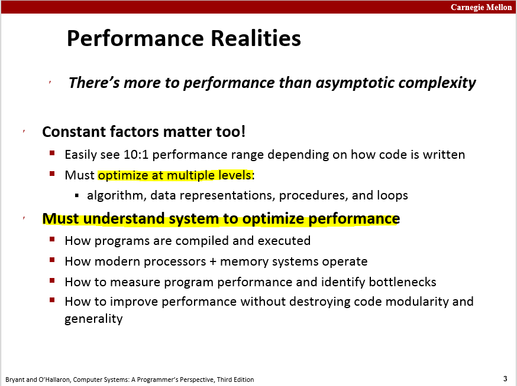

# Chapter 5 Optimizing Program Performance

## 程序优化

前面了解了许多机器代码以及程序执行机制的相关知识，这一节我们来学习如何利用这些性质来优化代码。

- 用好编译器的不同参数设定
- 写对编译器友好的代码，尤其是过程调用和内存引用，时刻注意内层循环
- 根据机器来优化代码，包括利用指令级并行、避免不可以预测的分支以及有效利用缓存



### 通用技巧

即使是常数项系数的操作，同样可能影响性能。性能的优化是一个多层级的过程：算法、数据表示、过程和循环，都是需要考虑的层次。于是，这就要求我们需要对系统有一定的了解，例如：

- 程序是如何编译和执行的
- 现代处理器和内存是如何工作的
- 如何衡量程序的性能以及找出瓶颈
- 如何保持代码模块化的前提下，提高程序性能

最根源的优化是对编译器的优化，比方说再寄存器分配、代码排序和选择、死代码消除、效率提升等方面，都可以由编译器做一定的辅助工作。

但是因为这毕竟是一个自动的过程，而代码本身可以非常多样，在不能改变程序行为的前提下，很多时候编译器的优化策略是趋于保守的。并且大部分用来优化的信息来自于过程和静态信息，很难充分进行动态优化。

接下来会介绍一些我们自己需要注意的地方，而不是依赖处理器或者编译器来解决。

### 代码移动

如果一个表达式总是得到同样的结果，最好把它移动到循环外面，这样只需要计算一次。编译器有时候可以自动完成，比如说使用 `-O1` 优化。一个例子：

```c++
void set_row(double *a, double *b, long i, long n){
    long j;
    for (j = 0; j < n; j++){
        a[n*i + j] = b[j];
    }
}
```

这里 `n*i` 是重复被计算的，可以放到循环外面

```c++
long j;
int ni = n * i;
for (j = 0; j < n; j++){
    a[ni + j] = b[j];
}
```

### 减少计算强度

用更简单的表达式来完成用时较久的操作，例如 `16*x` 就可以用 `x << 4` 代替，一个比较明显的例子是，可以把乘积转化位一系列的加法，如下：

```c++
for (i = 0; i < n; i++){
    int ni = n * i;
    for (j = 0; j < n; j++)
        a[ni + j] = b[j];
}
```

可以把 `n*i` 用加法代替，比如：

```c++
int ni = 0;
for (i = 0; i < n; i++){
    for (j = 0; j < n; j++)
        a[ni + j] = b[j];
    ni += n;
}
```

### 公共子表达式

可以重用部分表达式的计算结果，例如：

```c++
/* Sum neighbors of i, j */
up =    val[(i-1)*n + j  ];
down =  val[(i+1)*n + j  ];
left =  val[i*n     + j-1];
right = val[i*n     + j+1];
sum = up + down + left + right;
```

可以优化为

```c++
long inj = i*n + j;
up =    val[inj - n];
down =  val[inj + n];
left =  val[inj - 1];
right = val[inj + 1];
sum = up + down + left + right;
```

虽然说，现代处理器对乘法也有很好的优化，但是既然可以从 3 次乘法运算减少到只需要 1 次，为什么不这样做呢？蚂蚁再小也是肉嘛。

### 小心过程调用

我们先来看一段代码，找找有什么问题：

```c++
void lower1(char *s){
    size_t i;
    for (i = 0; i < strlen(s); i++)
        if (s[i] >= 'A' && s[i] <= 'Z')
            s[i] -= ('A' - 'a');
}
```

问题在于，在字符串长度增加的时候，时间复杂度是二次方的！每次循环中都会调用一次 `strlen(s)`，而这个函数本身需要通过遍历字符串来取得长度，因此时间复杂度就成了二次方。

可以怎么优化呢？简单，那么只计算一次就好了：

```c++
void lower2(char *s){
    size_t i;
    size_t len = strlen(s);
    for (i = 0; i < len; i++)
        if (s[i] >= 'A' && s[i] <= 'Z')
            s[i] -= ('A' - 'a');
}
```

为什么编译器不能自动把这个过程调用给移到外面去呢？

前面说过，编译器的策略必须是保守的，因为过程调用之后所发生的事情是不可控的，所以不能直接改变代码逻辑，比方说，假如 `strlen` 这个函数改变了字符串 `s` 的长度，那么每次都需要重新计算。如果移出去的话，就会导致问题。

所以很多时候只能靠程序员自己进行代码优化。

### 注意内存问题

接下来我们看另一段代码及其汇编代码

```c++
// 把 nxn 的矩阵 a 的每一行加起来，存到向量 b 中
void sum_rows1(double *a, double *b, long n)
{
    long i, j;
    for (i = 0; i < n; i++)
    {
        b[i] = 0;
        for (j = 0; j < n; j++)
            b[i] += a[i*n + j];
    }
}
```

对应的汇编代码为

```c++
# sum_rows1 的内循环
.L4:
    movsd   (%rsi, %rax, 8), %xmm0  # 浮点数载入
    addsd   (%rdi), %xmm0           # 浮点数加
    movsd   %xmm0, (%rsi, %rax, 8)  # 浮点数保存
    addq    $8, %rdi
    cmpq    %rcx, %rdi
    jne     .L4
```

可以看到在汇编中，每次都会把 `b[i]` 存进去再读出来，为什么编译器会有这么奇怪的做法呢？因为有可能这里的 `a` 和 `b` 指向的是同一块内存地址，那么每次更新，都会使得值发生变化。但是中间过程是什么，实际上是没有必要存储起来的，所以我们引入一个临时变量，这样就可以消除内存引用的问题。

```c++
// 把 nxn 的矩阵 a 的每一行加起来，存到向量 b 中
void sum_rows2(double *a, double *b, long n)
{
    long i, j;
    for (i = 0; i < n; i++)
    {
        double val = 0;
        for (j = 0; j < n; j++)
            val += a[i*n + j];
        b[i] = val;
    }
}
```

对应的汇编代码为

```c++
# sum_rows2 内循环
.L10:
    addsd   (%rdi), %xmm0   # 浮点数载入 + 加法
    addq    $9, %rdi
    cmpq    %rax, %rdi
    jne     .L10
```

可以看到，加入了临时变量后，解决了奇怪的内存问题，生成的汇编代码干净了许多。

### 处理条件分支

这个问题，如果不是对处理器执行指令的机制有一定了解的话，可能会难以理解。

现代处理器普遍采用超标量设计，也就是基于流水线来进行指令的处理，也就是说，当执行当前指令时，接下来要执行的几条指令已经进入流水线的处理流程了。

这个很重要，对于顺序执行来说，不会有任何问题，但是对于条件分支来说，在跳转指令时可能会改变程序的走向，也就是说，之前载入的指令可能是无效的。这个时候就只能清空流水线，然后重新进行载入。为了减少清空流水线所带来的性能损失，处理器内部会采用称为『分支预测』的技术。

比方说在一个循环中，根据预测，可能除了最后一次跳出循环的时候会判断错误之外，其他都是没有问题的。这就可以接受，但是如果处理器不停判断错误的话（比方说代码逻辑写得很奇怪），性能就会得到极大的拖累。

分支问题有些时候会成为最主要的影响性能的因素，但有的时候其实很难避免。

