# Chapter 9 Virtual Memmory

## 从物理内存到虚拟内存

早期的 PC 使用物理寻址，而且诸如数字信号处理器、嵌入式微控制器以及 Cray 超级计算机这样的系统仍然继续使用这种寻址方式。然而，现代处理器使用的是一种称为虚拟寻址 (virtual addressing) 的寻址形式，通过 MMU(Memory management unit)把虚拟地址(Virtual Address, VA)转换为物理地址(Physical Address, PA)，再由此进行实际的数据传输。大致的过程如下图所示

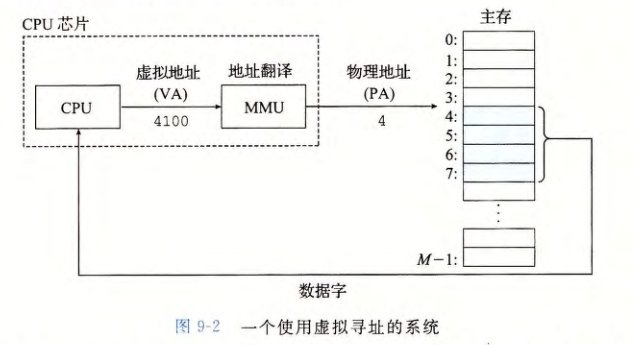

使用虚拟内存主要是基于下面三个考虑：

1. 可以更有效率的使用内存：使用 DRAM 当做部分的虚拟地址空间的缓存
2. 简化内存管理：每个进程都有统一的线性地址空间
3. 隔离地址控件：进程之间不会相互影响；用户程序不能访问内核信息和代码

## 虚拟内存的三个角色

### 作为缓存工具

概念上来说，虚拟内存就是存储在磁盘上的 N 个连续字节的数组。这个数组的部分内容，会缓存在 DRAM 中，在 DRAM 中的每个缓存块(cache block)就称为页(page)，如下图所示：

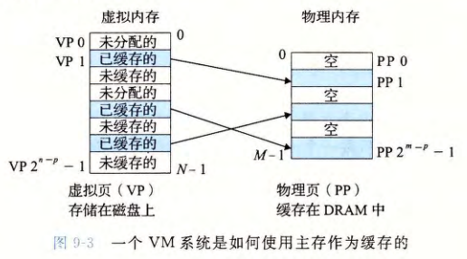

大致的思路和之前的 cache memory 是类似的，就是利用 DRAM 比较快的特性，把最常用的数据换缓存起来。如果要访问磁盘的话，大约会比访问 DRAM 慢一万倍，所以我们的目标就是尽可能从 DRAM 中拿数据。为此，我们需要：

- 更大的页尺寸(page size)：通常是 4KB，有的时候可以达到 4MB
- 全相联(Fully associative)：每一个虚拟页(virual page)可以放在任意的物理页(physical page)中，没有限制。
- 映射函数非常复杂，所以没有办法用硬件实现，通常使用 Write-back 而非 Write-through 机制
  - Write-through: 命中后更新缓存，同时写入到内存中
  - Write-back: 直到这个缓存需要被置换出去，才写入到内存中（需要额外的 dirty bit 来表示缓存中的数据是否和内存中相同，因为可能在其他的时候内存中对应地址的数据已经更新，那么重复写入就会导致原有数据丢失）

具体怎么做呢？通过页表(page table)。每个页表实际上是一个数组，数组中的每个元素称为页表项(PTE, page table entry)，每个页表项负责把虚拟页映射到物理页上。在 DRAM 中，每个进程都有自己的页表，具体如下


因为有一个表可以查询，就会遇到两种情况，一种是命中(Page Hit)，另一种则是未命中(Page Fault)。

命中的时候，即访问到页表中蓝色条目的地址时，因为在 DRAM 中有对应的数据，可以直接访问。

不命中的时候，即访问到 page table 中灰色条目的时候，因为在 DRAM 中并没有对应的数据，所以需要执行一系列操作（从磁盘复制到 DRAM 中），具体为：

- 触发 Page fault，也就是一个异常
- Page fault handler 会选择 DRAM 中需要被置换的 page，并把数据从磁盘复制到 DRAM 中
- 重新执行访问指令，这时候就会是 page hit

复制过程中的等待时间称为 demand paging。

仔细留意上面的页表，会发现有一个条目是 null，也就是没有分配。具体的分配过程（比方说声明了一个大数组），就是让该条目指向虚拟内存（在磁盘上）的某个页，但并不复制到 DRAM，只有当出现 page fault 的时候才需要拷贝数据。

（简单来说，就是在主存中缓存虚拟页）

### 作为内存管理工具

前面提到，每个进程都有自己的虚拟地址空间，这样一来，对于进程来说，它们看到的就是简单的线性空间（但实际上在物理内存中可能是间隔、支离破碎的），具体的映射过程可以用下图表示：

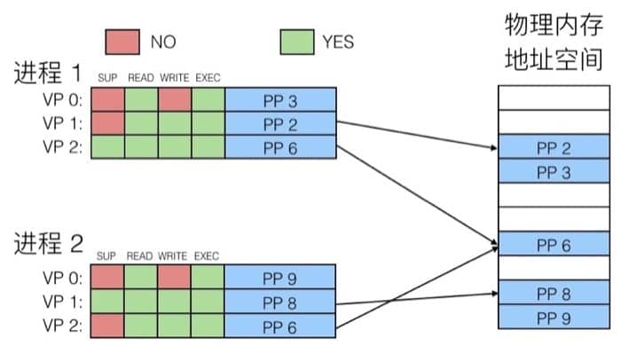

在内存分配中没有太多限制，每个虚拟页都可以被映射到任何的物理页上。这样也带来一个好处，如果两个进程间有共享的数据，那么直接指向同一个物理页即可（也就是上图 PP 6 的状况，只读数据）

虚拟内存带来的另一个好处就是可以简化链接和载入的结构（因为有了统一的抽象，不需要纠结细节）

### 作为内存保护工具

页表中的每个条目的高位部分是表示权限的位，MMU 可以通过检查这些位来进行权限控制（读、写、执行），如下图所示：

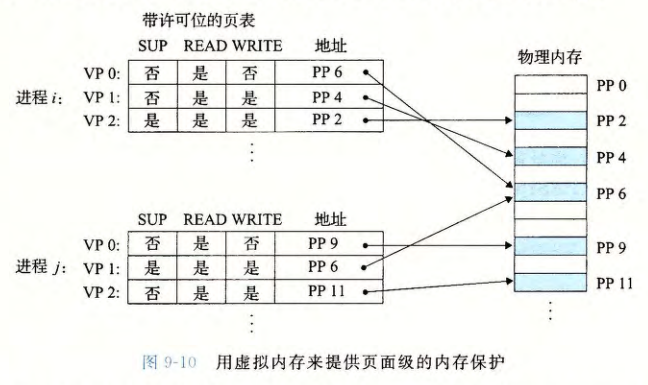

## 地址翻译

开始之前先来了解以下参数：
$$
N=2^n,M=2^m,P=2^p
$$


其中 `N` 表示虚拟地址空间中的地址数量，`M` 表示物理地址空间中的地址数量，`P` 是每一页包含的字节数(page size)。

虚拟地址(VA, Virtual Address)中的元素：

- `TLBI`: TLB 的索引值
- `TLBT`: TLB 的标签(tag)
- `VPO`: 虚拟页偏移量
- `VPN`: 虚拟页编号

物理地址(PA, physical address)中的元素：

- `PPO`: 物理页偏移量（与 `VPO` 的值相同）
- `PPN`: 物理页编号

然后我们通过一个具体的例子来说明如何进行地址翻译


具体的访问过程为：

- 通过虚拟地址找到页表(page table)中对应的条目
- 检查有效位(valid bit)，是否需要触发页错误(page fault)
- 然后根据页表中的物理页编号(physical page number)找到内存中的对应地址
- 最后把虚拟页偏移(virtual page offset)和前面的实际地址拼起来，就是最终的物理地址了

这里又分两种情况：Page Hit 和 Page Fault，我们先来看看 Page Hit 的情况


主要有 5 步，CPU 首先把虚拟地址发送给 MMU，MMU 检查缓存，并把从页表中得到对应的物理地址，接着 MMU 把物理地址发送给缓存/内存，最后从缓存/内存中得到数据。

而 Page Fault 的时候就复杂一些，第一次触发页错误会把页面载入内存/缓存，然后再以 Page Hit 的机制得到数据：

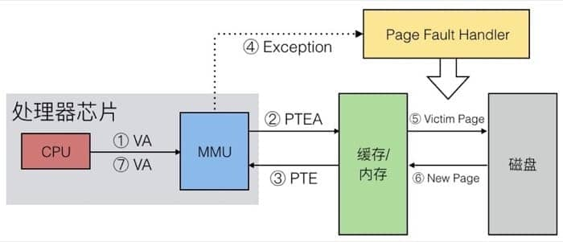

这里有 7 步，前面和 Page Hit 是一致的，先把虚拟地址发给 MMU 进行检查，然后发现没有对应的页，于是触发异常，异常处理器会负责从磁盘中找到对应页面并与缓存/内存中的页进行置换，置换完成后再访问同一地址，就可以按照 Page Hit 的方式来访问了。

虽然缓存已经很快了，但是能不能更快呢，为什么不能直接在 MMU 进行一部分的工作呢？于是就有了另外一个设计：Translation Lookaside Buffer(TLB)。TLB 实际上可以认为是页表在处理芯片上的缓存，整体的机制和前面提到的缓存很像，我们通过下面的图进行讲解：

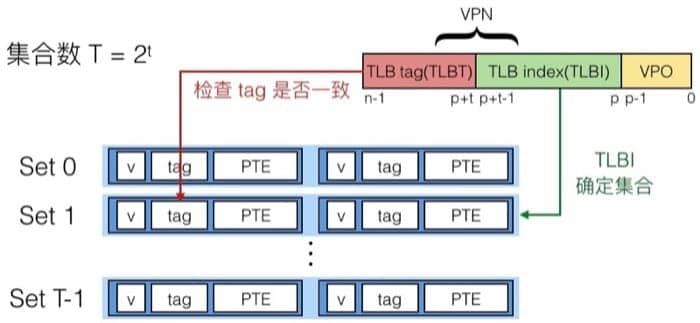

这里 VPN + VPO 就是虚拟地址，同样分成三部分，分别用于匹配标签、确定集合，如果 TLB 中有对应的记录，那么直接返回对应页表项(PTE)即可，如果没有的话，就要从缓存/内存中获取，并更新 TLB 的对应集合。

### 多层页表 Multi-Level Page Table

虽然页表是一个表，但因为往往虚拟地址的位数比物理内存的位数要大得多，所以保存页表项(PTE) 所需要的空间也是一个问题。举个例子：

假设每个页的大小是 4KB（2 的 12 次方），每个地址有 48 位，一条 PTE 记录有 8 个字节，那么要全部保存下来，需要的大小是：
$$
2^{48}×2^{−12}×2^3=2^{39}bytes
$$
整整 512 GB！所以我们采用多层页表，第一层的页表中的条目指向第二层的页表，一个一个索引下去，最终寻找具体的物理地址，整个翻译过程如下：


### 地址翻译实例

来看一个简单的例子，我们的内存系统设定如下：

- 14 位的虚拟地址
- 12 位的物理地址
- 页大小为 64 字节

TLB 的配置为：

- 能够存储 16 条记录
- 每个集合有 4 条记录

系统本身缓存（对应于物理地址）：

- 16 行，每个块 4 个字节
- 直接映射（即 16 个集合）

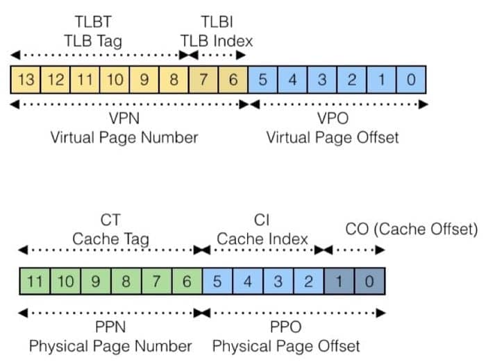

TLB 中的数据为


页表中的数据为（一共有 256 条记录，这里列出前 16 个）

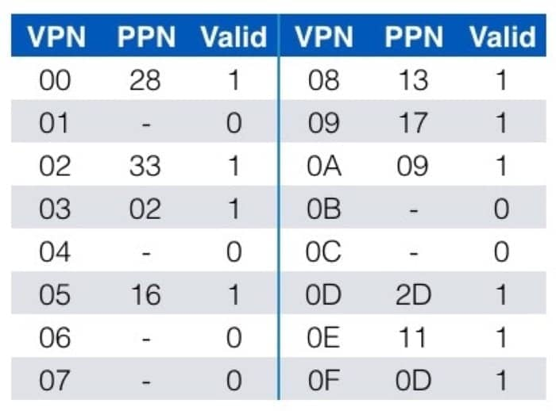

缓存中的数据为


一定要注意好不同部分的所代表的位置，这里我也会尽量写得清楚一些，来看第一个例子：

> 虚拟地址为 `0x03D4`

具体的转换过程如下图所示：

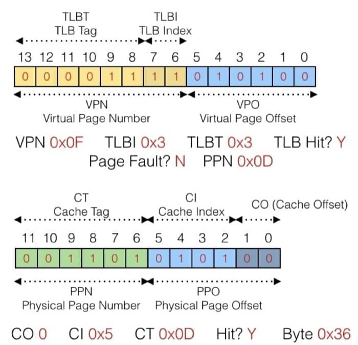

具体来梳理一次：

先看 TLB 中有没有对应的条目，所以先看虚拟地址的第 6-13 位，在前面的 TLB 表中，根据 TLBI 为 3 这个信息，去看这个 set 中有没有 tag 为 3 的项目，发现有，并且对应的 PPN 是 0x0D，所以对应到物理地址，就是 PPN 加上虚拟地址的 0-5 位，而具体的物理地址又可以在缓存中找到（利用 cache memory 的机制），就可以获取到对应的数据了。

下面的例子同样可以按照这个方法来进行分析

> 虚拟地址为 `0x0020`

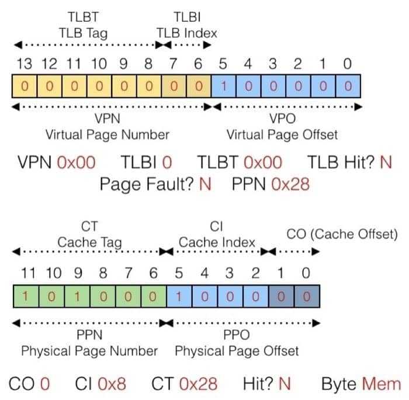

## 动态内存分配

前面了解了虚拟内存的相关知识，这一节我们来看看动态内存分配的基本概念，相信这之后就知道诸如 `malloc` 和 `new` 这类方法是怎么做的了。

程序员通过动态内存分配（例如 `malloc`）来让程序在运行时得到虚拟内存。动态内存分配器会管理一个虚拟内存区域，称为堆(heap)。

分配器以块为单位来维护堆，可以进行分配或释放。有两种类型的分配器：

- 显式分配器：应用分配并且回收空间（C 语言中的 `malloc` 和 `free`）
- 隐式分配器：应用只负责分配，但是不负责回收（Java 中的垃圾收集）

先来看看一个简单的使用 `malloc` 和 `free` 的例子

```c
#include <stdio.h>
#include <stdlib.h>

void foo(int n) {
    int i, *p;
    
    /* Allocate a block of n ints */
    p = (int *) malloc(n * sizeof(int));
    if (p == NULL) {
        perror("malloc");
        exit(0);
    }
    
    /* Initialize allocated block */
    for (i=0; i<n; i++)
        p[i] = i;

    /* Return allocated block to the heap */
    free(p);
}
```

复制

为了讲述方便，我们做如下假设：

- 内存地址按照字来编码
- 每个字的大小和整型一致

例如：

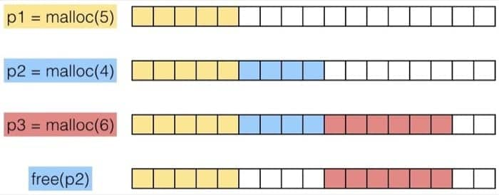

程序可以用任意的顺序发送 `malloc` 和 `free` 请求，`free` 请求必须作用与已被分配的 block。

分配器有如下的限制：

- 不能控制已分配块的数量和大小
- 必须立即响应 `malloc` 请求（不能缓存或者给请求重新排序）
- 必须在未分配的内存中分配
- 不同的块需要对齐（32 位中 8 byte，64 位中 16 byte）
- 只能操作和修改未分配的内存
- 不能移动已分配的块

### 性能指标

现在我们可以来看看如何去评测具体的分配算法了。假设给定一个 `malloc` 和 `free` 的请求的序列：
$$
R_0,R_1,...,R_k,...,R_{n−1}
$$
目标是尽可能提高吞吐量以及内存利用率（注意，这两个目标常常是冲突的）

吞吐量是在单位时间内完成的请求数量。假设在 10 秒中之内进行了 5000 次 `malloc` 和 5000 次 `free` 调用，那么吞吐量是 1000 operations/second

另外一个目标是 Peak Memory Utilization，就是最大的内存利用率。

影响内存利用率的主要因素就是『内存碎片』，分为内部碎片和外部碎片两种。

**内部碎片**

内部碎片指的是对于给定的块，如果需要存储的数据(payload)小于块大小，就会因为对齐和维护堆所需的数据结构的缘故而出现无法利用的空间，例如：


内部碎片只依赖于上一个请求的具体模式，所以比较容易测量。

**外部碎片**

指的是内存中没有足够的连续空间，如下图所示，内存中有足够的空间，但是空间不连续，所以成为了碎片：


### 实现细节

我们已经知道了原理，现在就来看看怎么样能够实现一个高效的内存分配算法吧！在具体实现之前，需要考虑以下问题：

- 给定一个指针，我们如何知道需要释放多少内存？
- 如何记录未分配的块？
- 实际需要的空间比未分配的空间要小的时候，剩下的空间怎么办？
- 如果有多个区域满足条件，如何选择？
- 释放空间之后如何进行记录？

具体这部分书中提到了四种方法：

1. 隐式空闲列表 Implicit List
2. 显式空闲列表 Explicit List
3. 分离的空闲列表 Segregated Free List
4. 按照大小对块进行排序 Blocks Sorted by Size

这里提一点，就是如何确定哪部分空间合适，有三种方法：

1. First Fit: 每次都从头进行搜索，找到第一个合适的块，线性查找
2. Next Fit: 每次从上次搜索结束的位置继续搜索，速度较快，但可能会有更多碎片
3. Best Fit: 每次遍历列表，找到最合适的块，碎片较少，但是速度最慢

更详细可以参考这两篇文章：[Dynamic Memory Allocation - Basic Concept](http://wdxtub.com/vault/csapp-18.html) 和 [Dynamic Memory Allocation - Advanced Concept](http://wdxtub.com/vault/csapp-19.html)

## 垃圾回收

所谓垃圾回收，就是我们不再需要显式释放所申请内存空间了，例如：

```c
void foo() {
    int *p = malloc(128);
    return; /* p block is now garbage*/
}
```

这种机制在许多动态语言中都有实现：Python, Ruby, Java, Perl, ML, Lisp, Mathematica。C 和 C++ 中也有类似的变种，但是需要注意的是，是不可能回收所有的垃圾的。

我们如何知道什么东西才是『垃圾』呢？简单！只要没有任何指针指向的地方，不管有没有用，因为都不可能被使用，当然可以直接清理掉啦。不过这其实是需要一些前提条件的：

- 我们可以知道哪里是指针，哪里不是指针
- 每个指针都指向 block 的开头
- 指针不能被隐藏(by coercing them to an `int`, and then back again)

相关的算法如下：

- Mark-and-sweep collection (McCarthy, 1960)
- Reference counting (Collins, 1960)
- Copying collection (Minsky, 1963)
- Generational Collectors(Lieberman and Hewitt, 1983)

大部分比较常用的算法居然都有五十多年历史了，神奇。更多相关细节在维基百科[2]中都有详细介绍（中文版本质量较差，这里给出英文版）。

## 内存陷阱

关于内存的使用需要注意避免以下问题：

- 解引用错误指针
- 读取未初始化的内存
- 覆盖内存
- 引用不存在的变量
- 多次释放同一个块
- 引用已释放的块
- 释放块失败

### Dereferencing Bad Pointers

这是非常常见的例子，没有引用对应的地址，少了 `&`

```c
int val;
...
scanf("%d", val);
```

### Reading Uninitialized Memory

不能假设堆中的数据会自动初始化为 0，下面的代码就会出现奇怪的问题（考虑使用calloc函数）

```c
/* return y = Ax */
int *matvec(int **A, int *x) {
    int *y = malloc(N * sizeof(int));
    int i, j;
    
    for (i = 0; i < N; i++)
        for (j = 0; j < N; j++)
            y[i] += A[i][j] * x[j];
    return y;
}
```

### Overwriting Memory

这里有挺多问题，第一种是分配了错误的大小，下面的例子中，一开始不能用 `sizeof(int)`，因为指针的长度不一定和 int 一样。

```c
int **p;
p = malloc(N * sizeof(int));

for (i = 0; i < N; i++) 
    p[i] = malloc(M * sizeof(int));
```

第二个问题是超出了分配的空间，下面代码的 for 循环中，因为使用了 `<=`，会写入到其他位置

```c
int **p;

p = malloc(N * sizeof (int *));

for (i = 0; i <= N; i++)
    p[i] = malloc(M * sizeof(int));
```

第三种是因为没有检查字符串的长度，超出部分就写到其他地方去了（经典的缓冲区溢出攻击也是利用相同的机制）

```c
char s[8];
int i;

gets(s); /* reads "123456789" from stdin */
```

第四种是没有正确理解指针的大小以及对应的操作，应该使用 `sizeof(int *)`

```c
int *search(int *p, int val) {
    while (*p && *p != null)
        p += sizeof(int);
    
    return p;
}
```

第五种是引用了指针，而不是其指向的对象，下面的例子中，`*size--` 一句因为 `--` 的优先级比较高，所以实际上是对指针进行了操作，正确的应该是 `(*size)--`

```c
int *BinheapDelete(int **binheap, int *size) {
    int *packet;
    packet = binheap[0];
    binheap[0] = binheap[*size - 1];
    *size--;
    Heapify(binheap, *size, 0);
    return (packet);
}
```

### Referencing Nonexistent Variables

下面的情况中，没有注意到局部变量会在函数返回的时候失效（所以对应的指针也会无效），这是传引用和返回引用需要注意的，传值的话则不用担心

```c
int *foo() {
    int val;
    
    return &val;
}
```

### Freeing Blocks Multiple Times

重复释放内存，一般在程序末尾进行一次清理即可

```c
x = malloc(N * sizeof(int));
//  <manipulate x>
free(x);

y = malloc(M * sizeof(int));
//  <manipulate y>
free(x);
```

### Referencing Freed Blocks

调用已释放的内存

```c
x = malloc(N * sizeof(int));
//  <manipulate x>
free(x);
//  ....

y = malloc(M * sizeof(int));
for (i = 0; i < M; i++)
    y[i] = x[i]++;
```

### Memory Leaks

用完没有释放，就是内存泄露啦

```c
foo() {
    int *x = malloc(N * sizeof(int));
    // ...
    return ;
}
```

或者只释放了数据结构的一部分：

```c
struct list {
    int val;
    struct list *next;
};

foo() {
    struct list *head = malloc(sizeof(struct list));
    head->val = 0;
    head->next = NULL;
    //...
    free(head);
    return;
}
```