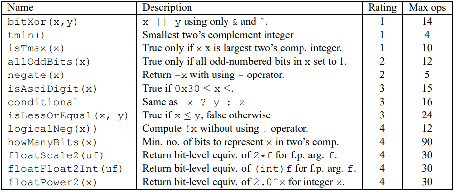

# Data Lab

### Content



### Rules

Interger coding rules:

```c++
Each "Expr" is an expression using ONLY the following:
  1. Integer constants 0 through 255 (0xFF), inclusive. You are
      not allowed to use big constants such as 0xffffffff.
  2. Function arguments and local variables (no global variables).
  3. Unary integer operations ! ~
  4. Binary integer operations & ^ | + << >>
    
  Some of the problems restrict the set of allowed operators even further.
Each "Expr" may consist of multiple operators. You are not restricted to
one operator per line.

You are expressly forbidden to:
  1. Use any control constructs such as if, do, while, for, switch, etc.
  2. Define or use any macros.
  3. Define any additional functions in this file.
  4. Call any functions.
  5. Use any other operations, such as &&, ||, -, or ?:
  6. Use any form of casting.
  7. Use any data type other than int.  This implies that you
     cannot use arrays, structs, or unions.

 
You may assume that your machine:
  1. Uses 2s complement, 32-bit representations of integers.
  2. Performs right shifts arithmetically.
  3. Has unpredictable behavior when shifting if the shift amount
     is less than 0 or greater than 31.
```

Floating point coding rules:

```c++
	For the problems that require you to implement floating-point operations,
the coding rules are less strict.  You are allowed to use looping and
conditional control.  You are allowed to use both ints and unsigneds.
You can use arbitrary integer and unsigned constants. You can use any arithmetic,
logical, or comparison operations on int or unsigned data.

You are expressly forbidden to:
  1. Define or use any macros.
  2. Define any additional functions in this file.
  3. Call any functions.
  4. Use any form of casting.
  5. Use any data type other than int or unsigned.  This means that you
     cannot use arrays, structs, or unions.
  6. Use any floating point data types, operations, or constants.
```

简单来说，位运算时不允许使用 `==` 类的判断， `-、 /、 * ` 类的四则运算，以及一些循环、条件类的结构。

### Summary

#### `bitXor(x,y)`

​		异或操作比较简单，根据真值表可以很轻易地发现，只需要对位与操作进行逐位取反即可。但是存在一个很容易疏忽的点就在于两个数同时为全0和同时为全1的情况，此时应该利用0逐位取反的值仍为自己的性质来进行排除.

- 此外，在进行位操作的时候，很多情况下会需要考虑极端值，如INT_MIN，INT_MAX，0，(-)1等.

#### `tmin()`

​		想要得到特定排布的值，只需对数值 `0x1` 进行移位运算即可。但仍需注意不同于左移操作补位为0，对负数进行右移操作的时候补位为1（此特点经常被用来构造全为1的32bit数值，即-1）.

#### `isTmax(x)`

​		Tmax的值其实并没有很优秀的判断特点，相反的，与其相对应的Tmin则有着非常优良的判断特性，于是通常会选择将问题分为 获取Tmin 和 判断Tmin 两步进行。利用Tmin仅sign bit为1的特点，利用左移一位后是否全部为0来判断Tmin应该是最快的方式（记得排除 `0x0`）。然而，笔者在前一步却碰到了问题，即：通过+1的方式得到Tmin则存在 `0xffffffff` 和 `0x80000001`两种情况，而通过逐位取反也同样会多出一个数字。最后选择在返回值前通过和自身的逻辑非进行加法来排除非目标数字，解决了问题.

#### `allOddBits(x)`

​		这个题目采用了构造掩码的方法，使用移位运算符构造出奇数位全1的数 `mask` ，然后获取输入 `x` 值的奇数位，其他位清零（`mask&x`），然后与 `mask` 进行异或操作，若相同则最终结果为0，然后返回其值的逻辑非。

- 异或操作常常被用来进行逐位比较，关键点在于如何构造出比较标准数使结果为 `0x0` 或 `0xffffffff`

#### `negate(x)`

​		补码的基本常识，本质是**阿贝尔群**的交换原理，对于 `-x`，`x` 是其补码，所以 `x` 可以通过对 `-x` 取反加1得到。

#### `isAsciiDigit(x)`

​		如何确定 `x` 是否在 0x30 - 0x39 范围内就是这个题的难点，在位操作中，通常通过构造上界和下界的补码来实现。一个界限是加上比0x39大的数后符号由正变负，另一个则是加上比0x30小的值时是负数。这两个数是代码中初始化的 `upperBound` 和 `lowerBound`，然后加法之后获取其符号位判断即可。

#### `conditional(x, y, z)`

​		这道题目是经典的通过位操作实现条件判断，由于最终需要的值是y和z中的一个，所以返回值一定是 `(? y) | (? z)` 的形式，而括号内则是通过对条件x的构造是其变为 `0x0` 或 `0xffffffff` 然后将其与目标值y或z进行位与操作来得到结果.

#### `isLessOrEqual(x,y)`

​		通过位运算实现比较两个数的大小，将其分为两种情况：一是符号不同正数为大，二是符号相同看差值符号。于是我们可以通过两次查看两次sign bit的值进行位或操作即可.

- `&&` 在位操作中通常使用 `|`来实现，同时`||` 在位操作中通常使用 `&`来实现

#### `logicalNeg(x)`

​		对于c语言中int值的布尔判断，逻辑非就是`0x0`，其他一切非零的数均为`true`。利用其补码（取反加一）的性质，除了0和最小数（符号位为1，其余为0），外其他数都是互为相反数关系（符号位取位或为1）。0和最小数的补码是本身，不过0的符号位与其补码符号位位或为0，最小数的为1.

#### `howManyBits(x)`

​		检测需要多少bit来表示一个int数的二进制编码，同时由题目可知，如果是一个正数，则需要找到它值为1的最高一位的位置，再加上符号位即可；如果是一个负数，则需要知道其值为0最高的一位的位置再加上符号位。通过二分查找的方式最为准确，其中缩减区间的方式即为左移或右移操作.

#### `floatScale2(f)`

​		要实现单精度浮点数的乘法运算，首先应该熟悉其结构

```bash
s | exp (8 bits) |        frac (23 bits)
---------------------------------------
0 | 01111111     | 00000000000000000000000
```

​		首先排除无穷小、0、无穷大和非数值NaN的情况进行剪枝，此时浮点数指数部分分别存储的的为0，0，,255，255。这些情况，无穷大和NaN都只需要返回参数，无穷小和0只需要将原数乘二再加上符号位就行了。剩下的情况，如果指数+1之后为指数为255则返回原符号无穷大，否则返回指数+1之后的原符号数。

- 在进行四则运算的情况下，一定靠考虑精度和界限的问题，否则很容易出现问题

#### `floatFloat2Int(f)`

​		想要将单精度浮点数 `float` 进行类型转换变为有符号整型数 `int` ，首先考虑特殊情况：如果原浮点值为0则返回0；如果真实指数大于31（frac部分是大于等于1的，1<<31位会覆盖符号位），返回规定的溢出值**0x80000000**；如果 $exp<0$ （1右移x位,x>0，结果为0）则返回0。剩下的情况：首先把小数部分（23位）转化为整数（和23比较），然后判断是否溢出：如果和原符号相同则直接返回，否则如果结果为负（原来为正）则溢出返回越界指定值**0x80000000**，否则原来为负，结果为正，则需要返回其补码（相反数）。

#### `floatPower2(x)`

​		想求$2.0^x$，只需要得到偏移之后的指数值e，如果e小于等于0（为0时，结果为0，因为2.0的浮点表示frac部分为0），对应的如果e大于等于255则为无穷大或越界了。否则返回正常浮点值，frac为0，直接对应指数即可。

