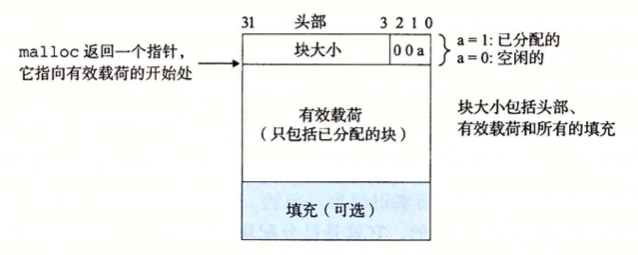
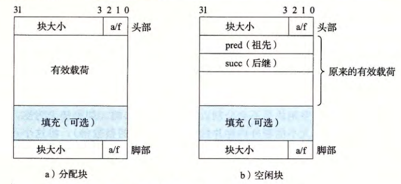

#  Malloc Lab

### Content

In this lab you will be writing a dynamic storage allocator for C programs, i.e., your own version of the
malloc, free and realloc routines. You are encouraged to explore the design space creatively and
implement an allocator that is correct, efficient and fast.

These semantics match the the semantics of the corresponding libc malloc, realloc, and free rou-
tines. Type man malloc to the shell for complete documentation

简而言之，我们需要实现的是libc库中与动态内存分布有关的4个函数。此外需要指出的是在 `mm.c` 文件中，已经预先提供了一个最简单的但是功能正确的 `malloc` 方法。在writeup中，建议尝试以此为基础对函数进行修改，以满足如下要求：

- `mm_init`：在调用 `mm_malloc`，`mm_realloc` 或 `mm_free` 之前，调用 `mm_init` 进行初始化，正确返回 `0`，有问题则返回 `-1`
- `mm_malloc`：在堆区域分配至少 `size` 大小的空间，返回的指针应该是 `8` 字节对齐的。同时确保分配的内存空间不会与其他已分配的内存块重叠
- `mm_free`：释放 `ptr` 所指向的内存块。
- `mm_realloc`：返回指向一个大小至少为 `size` 的区域指针，满足以下条件：
  - 如果 `ptr` 为 `NULL`，则调用相当于 `mm_malloc(size)`
  - 如果 `size` 大小为 `0`，则调用相当于 `mm_free(ptr)`
  - 如果 `ptr` 不为 `NULL`，且 `ptr` 为之前某次调用 `mm_malloc` 或者 `mm_realloc` 返回的指针。本次调用将改变 `ptr` 指向的内存块的大小，将其变为 `size` 个字节，并返回新内存块的地址

此外，除了主要的内存分配器之外，我们还需要实现对内存一致性的检查器。在运行时，该检查器将对整个堆内存空间进行扫描，例如需要检查的问题包括但不限于：

- 是否在空闲列表中的每一个内存块均被标记为空闲状态？
- 是否存在连续的空闲内存块忘记被合并了？
- 空闲列表在每次操作后是否包含了所有的空闲内存块？
- 空闲列表中的指针是否指向了有效的空闲内存块？
- 已分配的内存块之间有没有出现重叠的异常状况？
- 在堆内存块中的指针是否指向了有效的对内存地址？

当内存检查未通过时，打印对应的错误信息方便排查。不过需要记得在进行最后的性能测试时注释掉，以免造成性能损耗

### Preparation

要进行动态内存分布，首先要先清楚堆（Heap）的结构：

堆是由低地址向高地址延申的，其中`brk`会保留已使用的堆顶的位置。然后我们来看堆中是如何存储数据的，

其中每一个block（无论是否被分配）的隐式空闲链表结构如下：

同样，我们还有另一种存储方式，叫做显式空闲链表，如下：

其中分配块的内部结构与隐式空闲链表结构一致，而在空闲块中有一个指向相邻空闲块的指针

### Puzzles

1. `mm_init`：

   mm_init需要实现的效果是对堆（Heap）进行初始化，正确返回 `0`，有问题则返回 `-1`

   如图所示，主要任务是设置序言块和结尾块。这里需要注意的是几个block的大小是一个字（即4个byte），以及我们需要自己实现一个新的向 `brk` 申请更多内存的extend函数。有一个非常重要的点是初始化的堆的内存必须是偶数个字的大小，否则会造成字节的不对齐导致后面分配到顶部的时候出错

2. `mm_malloc`：。

   mm_malloc将向内存申请一个 `size` 字节的块，同时返回8字节对齐的指针。首先需要注意的问题是在本模型中，一个内存块至少需要 `16` 字节的空间，其中 `8` 字节留给头部和脚部，另外 `8` 字节作为满足对齐的最低要求。而对于超过 `8` 字节的请求，则是一律需要向上对齐到 `8` 的整数倍。

   剩余的主要逻辑就是需要在空闲链表中进行查找，查看是否有大于等于该要求的空闲内存块，这里我们选取的是的Best Fit的策略，实现一个简单分配器find_fit，来找到Heap中已存在的最适配空闲块，如果没有，则向`brk`申请更多的空间。

   最后，我们还需要在分配好的空闲块上进行截断等操作，并对截出来的空闲块重新进行头部和脚部标记，这块功能我们将在 `place` 方法中处理。

3. `mm_free`：

   mm_free释放 `ptr` 所指向的内存块。释放本身很简单，只需要先找到指针所指的block的head和foot然后将valid bit设置为0即可。然而，为了保证空间利用率和节省分配的资源，我们必须合并相邻空闲块，于是一共存在如图所示的四种情况：

​		故而需要实现coalesce函数，每次合并后找到合适的大小重新设置head和foot

4. `mm_realloc`：返回指向一个大小至少为 `size` 的区域指针，满足以下条件：

   - 如果 `ptr` 为 `NULL`，则调用相当于 `mm_malloc(size)`
   - 如果 `size` 大小为 `0`，则调用相当于 `mm_free(ptr)`
   - 如果 `ptr` 不为 `NULL`，且 `ptr` 为之前某次调用 `mm_malloc` 或者 `mm_realloc` 返回的指针。本次调用将改变 `ptr` 指向的内存块的大小，将其变为 `size` 个字节，并返回新内存块的地址

   于是我们直接分情况调用上述以实现的方法即可，不过记得将之前存储的数据转移到重分配的内存位置

5. `mm_check`:

   由于隐式链表的特殊性，最后决定把检测内容分在以下几点就好：

   - 能够从堆内存头部遍历到尾部而不存在空缺
   - 每个内存块的有效载荷都与 `8` 字节对齐
   - 每个内存块的头部脚部信息一致
   - 不存在两个连续的空闲内存块

第一点和第四点进行遍历看是否中断，以及是否利用完初始化已申请的内存即可；

第二点我们利用位运算`(size_t)(ptr) & 0x7`，这里将指针 `ptr` 转换为 `size_t` 类型，并通过与操作符 `&` 和十六进制掩码 `0x7` 进行按位与运算。这个操作检查指针的最低3位是否都为0，因为0x7的二进制表示为0000111。如果这三位不为0，说明指针没有按照8字节对齐，即不是8的倍数；

第三点由于head和foot都是unsigned直接比较是否相等即可；

