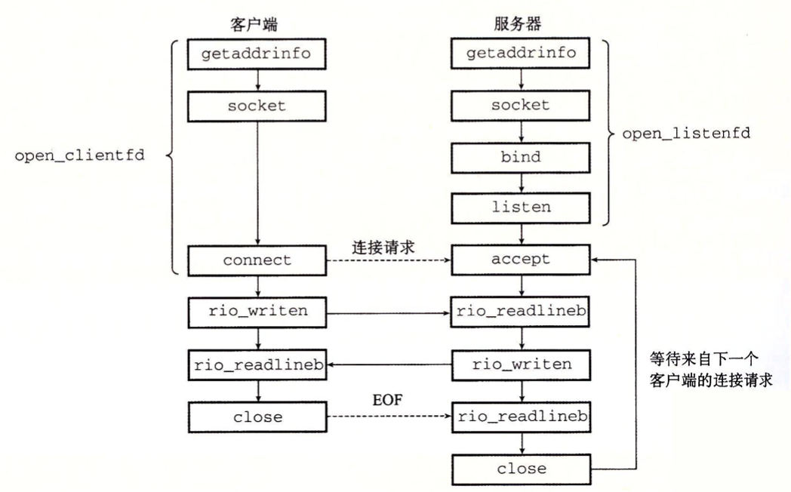
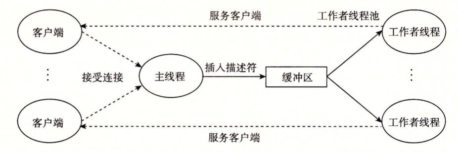

#  Proxy Lab


### Content

In this lab, you will write a simple HTTP proxy that caches web objects. For the first part of the lab, you will
set up the proxy to accept incoming connections, read and parse requests, forward requests to web servers,
read the servers’ responses, and forward those responses to the corresponding clients. This first part will
involve learning about basic HTTP operation and how to use sockets to write programs that communicate
over network connections. In the second part, you will upgrade your proxy to deal with multiple concurrent
connections. This will introduce you to dealing with concurrency, a crucial systems concept. In the third
and last part, you will add caching to your proxy using a simple main memory cache of recently accessed
web content

简单来说，本lab的是:

1. 完成一个可以利用HTTP协议接受client端的request并且发送server端的response的简单服务器代理；
2. 为本服务器添加并行处理的逻辑，保证可以同时处理多个socekt之间的信息传递；
3. 将服务器缓存拓展为server端的临时cache，使代理的响应更加迅速；

### Preparation

**服务器的基本工作流程**有 5 步：

1. 开启服务器（`open_listenfd`函数，做好接收请求的准备）
   - `getaddrinfo`: 设置服务器的相关信息
   - `socket`: 创建 socket descriptor，也就是之后用来读写的 file descriptor
     - `int socket(int domain, int type, int protocol)`
     - 例如 `int clientfd = socket(AF_INET, SOCK_STREAM, 0);`
     - `AF_INET` 表示在使用 32 位 IPv4 地址
     - `SOCK_STREAM` 表示这个 socket 将是 connection 的 endpoint
     - 前面这种写法是协议相关的，建议使用 `getaddrinfo` 生成的参数来进行配置，这样就是协议无关的了
   - `bind`: 请求 kernel 把 socket address 和 socket descriptor 绑定
     - `int bind(int sockfd, SA *addr, socklen_t addrlen);`
     - The process can read bytes that arrive on the connection whose endpoint is `addr` by reading from descriptor `sockfd`
     - Similarly, writes to `sockfd` are transferred along connection whose endpoint is `addr`
     - 最好是用 `getaddrinfo` 生成的参数作为 `addr` 和 `addrlen`
   - `listen`: 默认来说，我们从`socket`函数中得到的 descriptor 默认是 active socket（也就是客户端的连接），调用`listen`函数告诉 kernel 这个 socket 是被服务器使用的
     - `int listen(int sockfd, int backlog);`
     - 把 `sockfd` 从 active socket 转换成 listening socket，用来接收客户端的请求
     - `backlog` 的数值表示 kernel 在接收多少个请求之后（队列缓存起来）开始拒绝请求
   - [*]`accept`: 调用`accept`函数，开始等待客户端请求
     - `int accept(int listenfd, SA *addr, int *addrlen);`
     - 等待绑定到 `listenfd` 的连接接收到请求，然后把客户端的 socket address 写入到 `addr`，大小写入到 `addrlen`
     - 返回一个 connected descriptor 用来进行信息传输（类似 Unix I/O）
     - 具体的过程可以参考 图3
2. 开启客户端（`open_clientfd`函数，设定访问地址，尝试连接）
   - `getaddrinfo`: 设置客户端的相关信息，具体可以参见 图1&2
   - `socket`: 创建 socket descriptor，也就是之后用来读写的 file descriptor
   - `connect`: 客户端调用`connect`来建立和服务器的连接
     - `int connect(int clientfd, SA *addr, socklen_t addrlen);`
     - 尝试与在 socker address `addr` 的服务器建立连接
     - 如果成功 `clientfd` 可以进行读写
     - connection 由 socket 对描述 `(x:y, addr.sin_addr:addr.sin_port)`
     - `x` 是客户端地址，`y` 是客户端临时端口，后面的两个是服务器的地址和端口
     - 最好是用 `getaddrinfo` 生成的参数作为 `addr` 和 `addrlen`
3. 交换数据（主要是一个流程循环，客户端向服务器写入，就是发送请求；服务器向客户端写入，就是发送响应）
   - [Client]`rio_writen`: 写入数据，相当于向服务器发送请求
   - [Client]`rio_readlineb`: 读取数据，相当于从服务器接收响应
   - [Server]`rio_readlineb`: 读取数据，相当于从客户端接收请求
   - [Server]`rio_writen`: 写入数据，相当于向客户端发送响应
4. 关闭客户端（主要是`close`）
   - [Client]`close`: 关闭连接
5. 断开客户端（服务接收到客户端发来的 EOF 消息之后，断开已有的和客户端的连接）
   - [Server]`rio_readlineb`: 收到客户端发来的关闭连接请求
   - [Server]`close`: 关闭与客户端的连接

**生产者-消费者模型**

具体的同步模型为：

- 生产者等待空的 slot，把 item 存储到 buffer，并通知消费者
- 消费整等待 item，从 buffer 中移除 item，并通知生产者

接下来我们实现一个有 n 个元素 buffer，为此，我们需要一个 mutex 和两个用来计数的 semaphore：

- `mutex`: 用来保证对 buffer 的互斥访问
- `slots`: 统计 buffer 中可用的 slot 数目
- `items`: 统计 buffer 中可用的 item 数目

我们直接来看代码，就比较清晰了

```c
// 头文件 sbuf.h
// 包括几个基本操作
#include "csapp.h"

typedef struct {
    int *buf;    // Buffer array
    int n;       // Maximum number of slots
    int front;   // buf[(front+1)%n] is first item
    int rear;    // buf[rear%n] is the last item
    sem_t mutex; // Protects accesses to buf
    sem_t slots; // Counts available slots
    sem_t items; // Counts available items
} sbuf_t;

void sbuf_init(sbuf_t *sp, int n);
void sbuf_deinit(sbuf_t *sp);
void sbuf_insert(sbuf_t *sp, int item);
int sbuf_remove(sbuf_t *sp);
```

然后是具体的实现

```c
// sbuf.c

// Create an empty, bounded, shared FIFO buffer with n slots
void sbuf_init(sbuf_t *sp, int n) {
    sp->buf = Calloc(n, sizeof(int));
    sp->n = n;                  // Buffer holds max of n items
    sp->front = sp->rear = 0;   // Empty buffer iff front == rear
    Sem_init(&sp->mutex, 0, 1); // Binary semaphore for locking
    Sem_init(&sp->slots, 0, n); // Initially, buf has n empty slots
    Sem_init(&sp->items, 0, 0); // Initially, buf has 0 items
}

// Clean up buffer sp
void sbuf_deinit(sbuf_t *sp){
    Free(sp->buf);
}

// Insert item onto the rear of shared buffer sp
void sbuf_insert(sbuf_t *sp, int item) {
    P(&sp->slots);                        // Wait for available slot
    P(&sp->mutext);                       // Lock the buffer
    sp->buf[(++sp->rear)%(sp->n)] = item; // Insert the item
    V(&sp->mutex);                        // Unlock the buffer
    V(&sp->items);                        // Announce available item
}

// Remove and return the first tiem from the buffer sp
int sbuf_remove(sbuf_f *sp) {
    int item;
    P(&sp->items);                         // Wait for available item
    P(&sp->mutex);                         // Lock the buffer
    item = sp->buf[(++sp->front)%(sp->n)]; // Remove the item
    V(&sp->mutex);                         // Unlock the buffer
    V(&sp->slots);                         // Announce available slot
    return item;
}
```

### Puzzles

#### Part1 implementing a sequential web proxy

这个部分要搭建基础的单线程循环服务器，每一次循环体内我们用`doit`函数替代，其作用可以大致分为读取客户端请求和发送目标主机响应两方面，如图：



- 根据获取到的文件描述符，接受从客户端（浏览器）的请求。调用 `read_request` 读取请求，处理请求行和请求头，请存储下来。
- 在 `send_request` 中，根据客户端的代理请求，对请求内容稍加修改，例如请求行中的 `URI`，`Connection` 请求，`Proxy-Connection` 请求头和 `User-Agent` 请求头等，随后代理程序对目标主机发起新的请求，携带修改后的请求数据。
- 在 `forward_response` 中，程序将目标主机响应的数据转发给客户端，即从目标主机连接中读取数据写入和客户端的连接中。

`read_request`需要利用正则表达式解析客户端的请求，读取出Method、URI和HTTP版本，再将URI里的主机名 `Host`、请求路径 `Path` 以及请求端口号 `Port`存储进变量; `send_request`需要利用`Host`和`Port`的信息将目标主机套接字的监听状态改编为连接状态，通过`Rio_writen`进行写入处理; `forward_response`则需要读取并返回目标主机的响应，利用`Rio_readlineb`这个已经封装好的`I/O`函数即可

#### Part2 Dealing with multiple concurrent requests

目前我们已经实现了一个代理服务器，可惜是顺序执行的，只能执行部分基本的单线程功能。接下来我们要将其变为一个可以并发执行多个请求的程序。最简单的方法是每次产生一个新的线程来处理新的连接请求：



需要注意的问题有：

- 我们创建的线程应当使用分离模式 detached mode，防止资源未被回收导致的内存泄漏。
- `csapp.c` 中使用的 `open_clientfd` 和 `open_listenfd` 均使用了更新的 `getaddrinfo` 方法，因此均为线程安全的，不必担心。

我们考虑使用预线程化的策略，使用主线程接受请求，将描述符加入到缓冲区，作为生产者；使用工作者线程进行消费，从缓冲区中取出文件描述符，进行连接相关操作。

利用有限缓冲区 `sbuf_t` 的数据结构，我们首先在主线程中初始化缓冲区，创建若干个工作线程，随后开始循环接受客户端连接，将每次生成的连接文件描述符插入到缓冲区 `sbuf` 中。

注意到由于插入操作位于主线程中，因此是顺序执行的，不存在竞争的情况，不会有 `connfd` 被下一轮循环覆盖的可能。

在工作线程中，我们首先将线程进行分离，以避免内存泄漏情况发生。接下来，不断循环尝试从缓冲区 `sbuf` 中取出连接文件描述符，取到后则进行后续的 `doit` 操作，即读取连接，分析连接，转发请求和转发响应，最后，我们将和客户端的连接关闭。

#### Part3 Caching web objects

这部分的逻辑和普通的`cache`差不多，每个缓存对内部都有有效标志位，请求 `request`，响应内容 `reponse` 和上次修改的时间戳 `time_stamp`。缓存内部需要使用一个 `mutex` 用来确保每次只有一个线程能对齐进行读写，同时我们还记录了一个缓存内部的缓存对数量。

在代理程序转发请求前，我们先考虑对缓存进行搜索，如果找到了，`cache_find` 函数会自动将缓存取出写回到客户端的连接中；如果没有找到，那么就进行正常的请求转发。其中在查找操作中，我们需要遍历缓存中的缓存对，查找是否有命中，如果有我们直接将缓存中内容写入到和客户端的连接中。在插入操作中，同理，我们先遍历缓存，如果有未被使用的空闲缓存对空间，我们就直接写进去，同时根据时间戳查找最久未使用的缓存对，当我们遍历结束发现没有空位就直接对最久未使用的缓存对直接操作。


